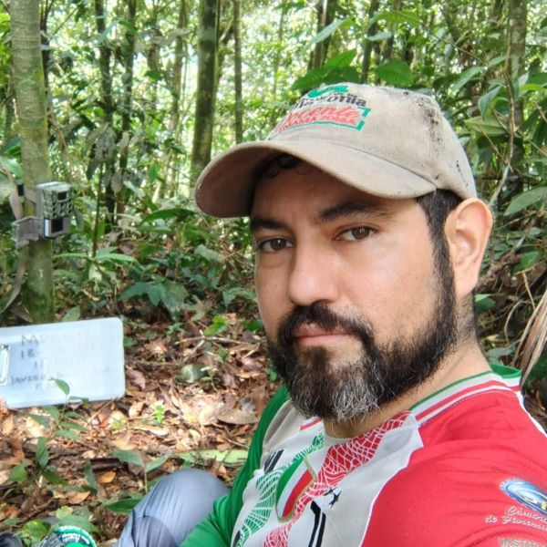
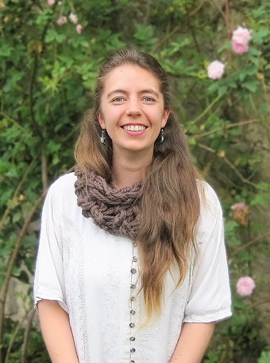
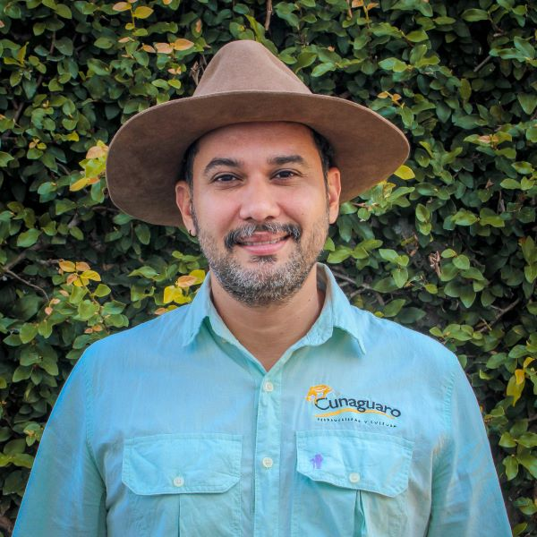
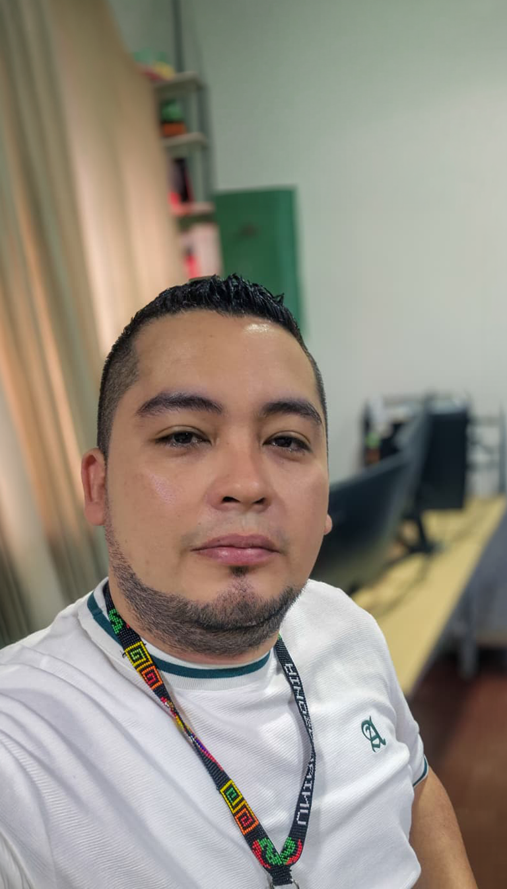
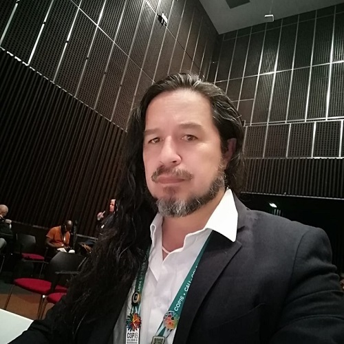
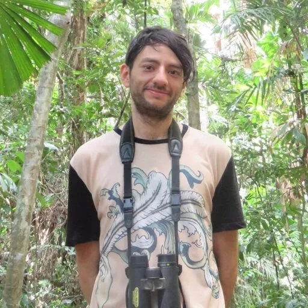
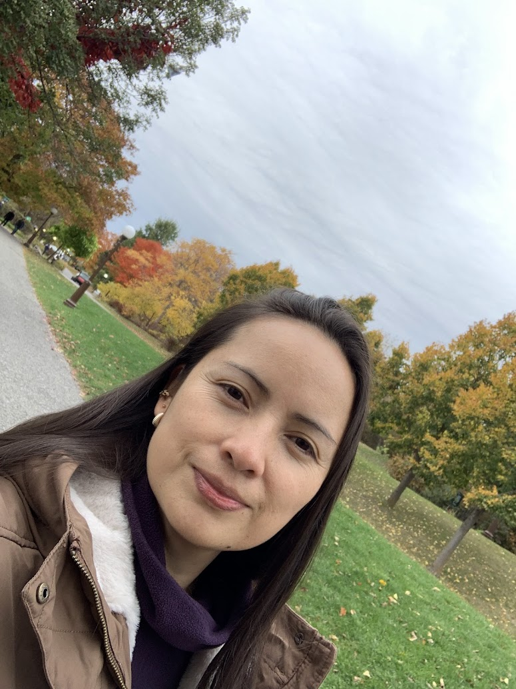
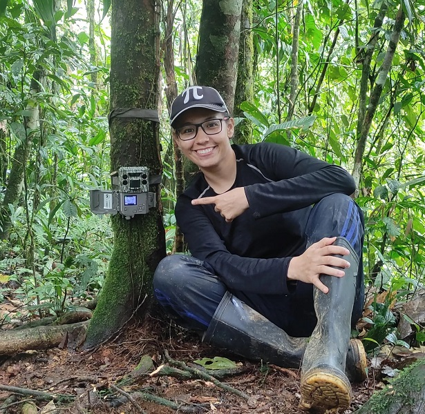
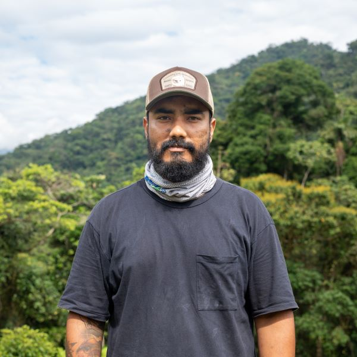
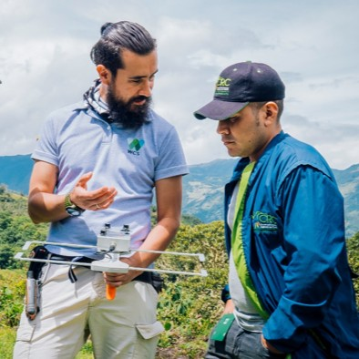

<section class="comites-page">

<aside class="comites-sidebar">

👥
Comités VICCM

<nav class="comites-nav">
<a href="#organizador" class="comite-nav-item active">📅Organizador5</a>
<a href="#cientifico" class="comite-nav-item">🧪Científico3</a>
<a href="#logistico" class="comite-nav-item">🚚Logístico1</a>
<a href="#comunicaciones" class="comite-nav-item">📣Comunicaciones1</a>
<a href="#financiero" class="comite-nav-item">🪙Financiero1</a>
<a href="#diversidad" class="comite-nav-item">🌎Diversidad2</a>
</nav>
</aside>

<main class="content-area">
<h1 class="page-title">Comités</h1>

Conoce a las personas que hacen posible el VICCM 2026

<section id="organizador" class="comite-section">

📅

<h2>Comité Organizador</h2>

Es responsable de definir el desarrollo a medio y largo plazo de la serie de conferencias y de garantizar que esta mantenga un alto nivel organizativo. El congreso suele tener una duración de una semana (de lunes a viernes) en noviembre 2026.

<h3>Javier García Villalba</h3>

Presidente

<h3>Catalina Concha Osbahr</h3>

Presidenta SCMas

<h3>Cesar Rojano Bolaños</h3>

Delegado Junta SCMas

<h3>Diego J. Lizcano</h3>

Página Web y OpenConf

<h3>Karol Andres Suarez</h3>

Diseñador Página Web

</section>

<section id="cientifico" class="comite-section">

🧪

<h2>Comité Científico</h2>

Su función es seleccionar las ponencias presentadas. Las ponencias se revisan y seleccionan en función de su excelencia científica. Los integrantes del Comité Científico realizan una selección final de las ponencias científicamente excelentes para crear un programa equilibrado e interesante.

<h3>Hugo Mantilla Meluk</h3>

Aspectos Científicos y Divulgación

<h3>Andres Felipe Suarez Castro</h3>

Comité Científico

<h3>Adriana C. Acero Murcia</h3>

Comité Científico

</section>

<section id="logistico" class="comite-section">

🚚

<h2>Comité Logístico</h2>

Se encarga de asegurar que el Congreso funcione de manera fluida y ordenada durante su ejecución presencial. Ofrece soporte a ponentes, asistentes, invitados y público general antes, durante y después del evento.

<h3>Luisa Fernanda Martínez</h3>

Comunicaciones y Logística

➕

<h3>Próximamente</h3>

Espacio disponible

</section>

<section id="comunicaciones" class="comite-section">

📣

<h2>Comité de Comunicaciones</h2>

Lidera la divulgación y posicionamiento del Congreso a nivel local, nacional e internacional. Gestiona la comunicación oficial mediante el envío y publicación oportuna de noticias, convocatorias y contenidos audiovisuales.

<h3>Erick D. Cardona</h3>

Comunicaciones

➕

<h3>Próximamente</h3>

Espacio disponible

</section>

<section id="financiero" class="comite-section">

🪙

<h2>Comité Financiero</h2>

Está a cargo de la planeación financiera del Congreso y de contribuir a su sostenibilidad. Apoya la búsqueda y gestión de recursos, patrocinios y apoyos.

<h3>Mauricio Vela</h3>

Tesorero

➕

<h3>Próximamente</h3>

Espacio disponible

</section>

<section id="diversidad" class="comite-section">

🌎

<h2>Comité de Diversidad e Integración Científica</h2>

Promueve un Congreso diverso, incluyente y representativo. Favorece la participación amplia de regiones, instituciones y diferentes trayectorias académicas.

➕

<h3>Próximamente</h3>

Espacio disponible

➕

<h3>Próximamente</h3>

Espacio disponible

</section>

</main>

</section>

<h2 id="modalNombre">Perfil del Miembro</h2>
<button class="modal-close" type="button" id="modalCloseBtn">&times;</button>

