<section class="breadcrumb-container">

<a href="index.html">⌂</a> › Cursos y talleres

</section>

<section class="cursos-hero">

<h1>Cursos y actividades académicas</h1>

Espacios de formación, intercambio de saberes y actualización en mastozoología durante el VICCM 2026

</section>

<!-- ==================== CURSOS ==================== -->
<section class="seccion-cursos">

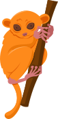
<h2>Cursos</h2>

<!-- CURSO REAL 1 -->
<article class="card-placeholder card-contenido">

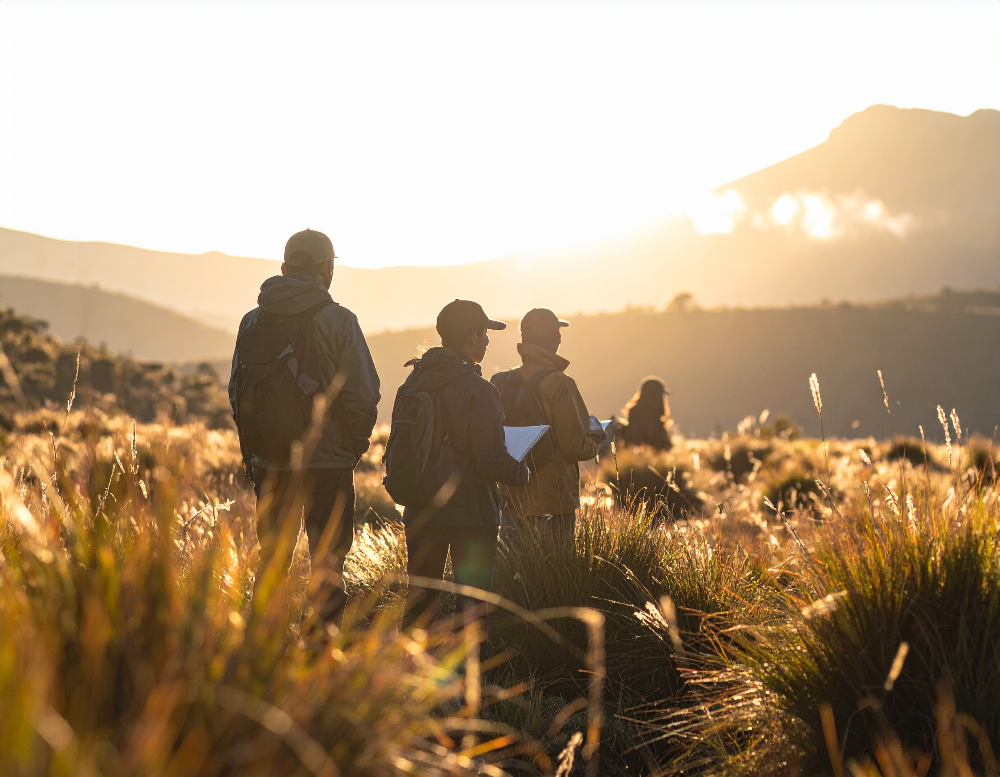

<h3 class="card-titulo">Conceptos y herramientas metodológicas en el estudio de las interacciones bióticas de mamíferos</h3>

Kevin González Gutiérrez
Alejandro Rodriguez Villa
John Harold Castaño Salazar

Las interacciones bióticas constituyen un componente fundamental para comprender la estructura y el funcionamiento de los ecosistemas.

<a href="cursos/c1_interacciones_bioticas_mamiferos/c1_interacciones_bioticas_mamiferos.html" class="card-boton">Ver el Curso Completo →</a>
</article>

<!-- CURSO REAL 2 -->
<article class="card-placeholder card-contenido">

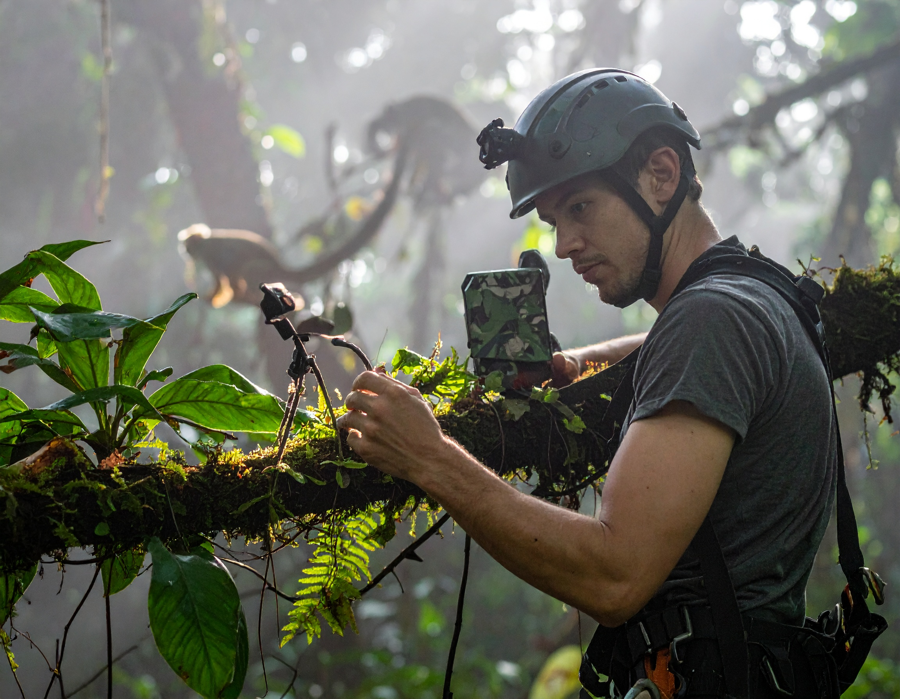

<h3 class="card-titulo">Investigación de Ciencia del Dosel para la conservación de mamíferos</h3>

Juan Lucas Capa Procel
Ollie Thomas 
Laura Suárez Ramírez
Alexis Ruiz Burbano

El curso Investigación de Ciencia del Dosel para la Conservación de Mamíferos tiene como objetivo principal fortalecer las capacidades técnicas y científicas de jóvenes, estudiantes y actores vinculados a la conservación, mediante la apropiación de herramientas básicas para la investigación del dosel.

<a href="cursos/c2_ciencia_dosel/c2_ciencia_dosel.html" class="card-boton">Ver el Curso Completo →</a>
</article>

<!-- CURSO REAL 3 -->
<article class="card-placeholder card-contenido">

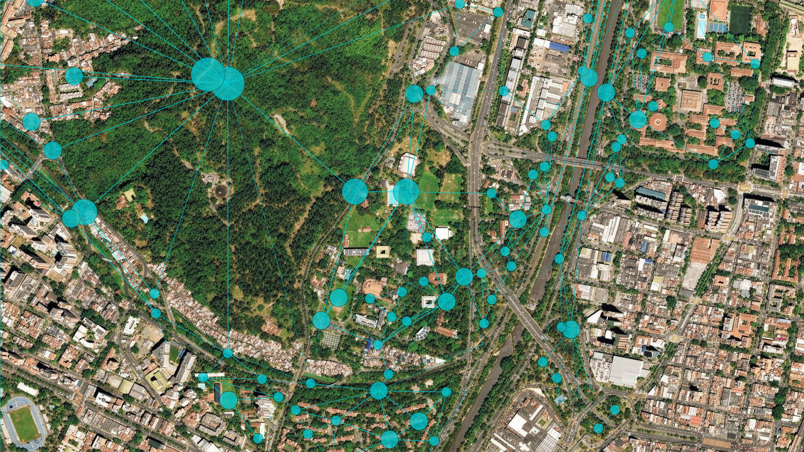

<h3 class="card-titulo">Modelamiento de Conectividad Ecológica Funcional en Evaluación de Impacto Ambiental.</h3>

Carlos Eduardo Ortiz Yusty
Diana Marcela Cardona Ramirez
María Camila Aduén Espinosa

El modelamiento de la conectividad ecológica se ha consolidado como una herramienta clave para identificar, evaluar y mitigar los impactos de proyectos de infraestructura sobre la biodiversidad y los procesos ecológicos a escala de paisaje.

<a href="cursos/c3_modelamiento_conectividad/c3_modelamiento_conectividad.html" class="card-boton">Ver el Curso Completo →</a>
</article>

<!-- CURSO REAL 4 -->
<article class="card-placeholder card-contenido">

<h3 class="card-titulo">Procesamiento, visualización y análisis de datos espaciales en R.</h3>

Diego J. Lizcano
Andrés Felipe Suárez Castro

Durante el curso, se presentarán diferentes estrategias que facilitan la detección de errores, la creación de gráficos y el resumen de grandes bases de datos para el análisis de biodiversidad.

<a href="cursos/c4_procesamiento/c4_procesamiento.html" class="card-boton">Ver el Curso Completo →</a>
</article>

<!-- CURSO REAL 5 -->
<article class="card-placeholder card-contenido">

<h3 class="card-titulo">De las Colecciones a la Comunidad: Taxidermia como Herramienta de Educación Ambiental para la Conservación Biológica</h3>

Manuela Alzate Lozada
Jaime Ramírez Mosquera
Natalia Ramírez Sáenz
Yesyca Andrea López Bolaños
Wilmar Guzmán Zapata
Lorena Alvear Narváez

La taxidermia, tradicionalmente asociada a colecciones científicas, ha adquirido un papel relevante en procesos de educación ambiental al facilitar una aproximación directa al conocimiento de las especies que representan la biodiversidad de una región.

<a href="cursos/c5_colecciones/c5_colecciones.html" class="card-boton">Ver el Curso Completo →</a>
</article>

<!-- CURSO REAL 6 -->
<article class="card-placeholder card-contenido">

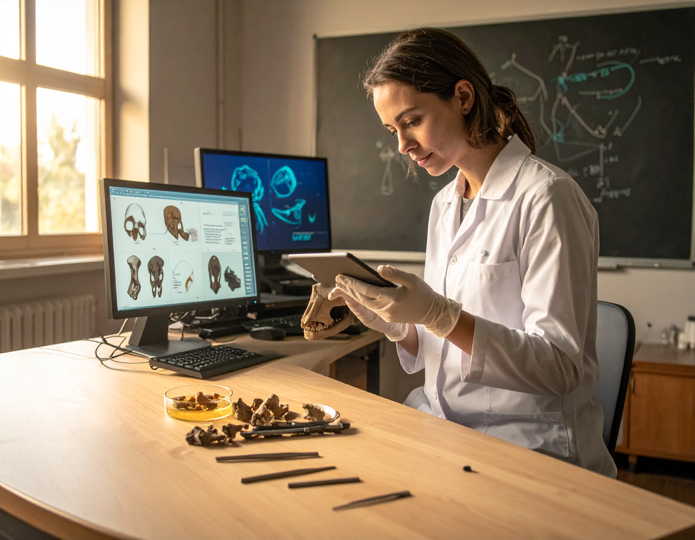

<h3 class="card-titulo">Curso básico teórico-práctico de morfometría geométrica aplicada usando MorphoJ.</h3>

Nicolas Reyes-Amaya
Alejandra Pardo
Paula Calambas Pizo

La morfometría geométrica ha emergido como un enfoque robusto para cuantificar y analizar la variación morfológica a partir de coordenadas espaciales, facilitando la separación entre tamaño y forma y permitiendo interpretar los cambios morfológicos de manera gráfica y estadísticamente sustentada.

<a href="cursos/c6_basico/c6_basico.html" class="card-boton">Ver el Curso Completo →</a>
</article>

</section>

<!-- ==================== TALLERES ==================== -->
<section class="seccion-cursos">

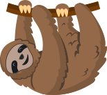
<h2>Talleres</h2>

<!-- TALLER REAL 1 -->
<article class="card-placeholder card-contenido">

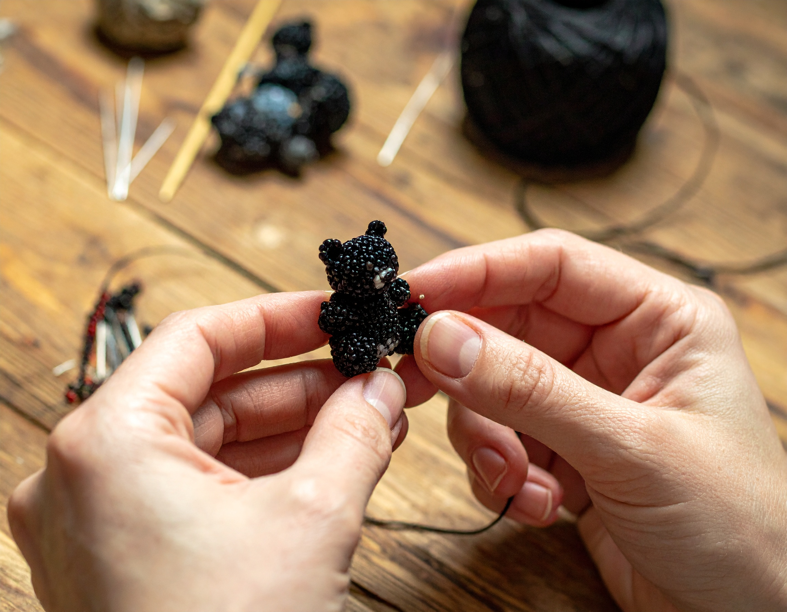

<h3 class="card-titulo">Tejiendo la conservación: arte y mamíferos en peligro</h3>

Leidy Laura Ocampo López

Fortalecer capacidades en educación para la conservación de mamíferos mediante el uso del tejido como herramienta pedagógica y comunitaria.

<a href="cursos/t1_tejiendo_conservacion/t1_tejiendo_conservacion.html" class="card-boton">Ver Taller Completo →</a>
</article>

<!-- TALLER REAL 2 -->
<article class="card-placeholder card-contenido">

<h3 class="card-titulo">Introducción al Estudio de los Refugios de Murciélagos en Colombia</h3>

Liceth Margarita Suárez Payares

Los refugios de murciélagos son elementos cruciales en la dinámica ecosistémica neotropical, su estudio y comprensión permite el acercamiento a escala fina, de fenómenos que escapan, en muchas ocasiones, de nuestra vista, pero que podrían tener un impacto al alcance de todos.

<a href="cursos/t2_murcielagos/t2_murcielagos.html" class="card-boton">Ver Taller Completo →</a>
</article>

<!-- TALLER REAL 3 -->
<article class="card-placeholder card-contenido">

<h3 class="card-titulo">Murcielloween: Investigación participativa para la conservación de murciélagos en entornos urbanos</h3>

Kevin Alexander Ramírez
Joseph Alejandro Romero
Cesar Camilo Castillo
Charles S. Muñoz Nates

El taller "Murcielloween", surge como una iniciativa de ciencia participativa desarrollada por la Universidad del Cauca para generar conocimiento sobre los murciélagos en entornos urbanos, dada la escasez de información sobre la quiropterofauna del campus y la necesidad de valorar este grupo biológico.

<a href="cursos/t3_murcielloween/t3_murcielloween.html" class="card-boton">Ver Taller Completo →</a>
</article>

<!-- TALLER REAL 4 -->
<article class="card-placeholder card-contenido">

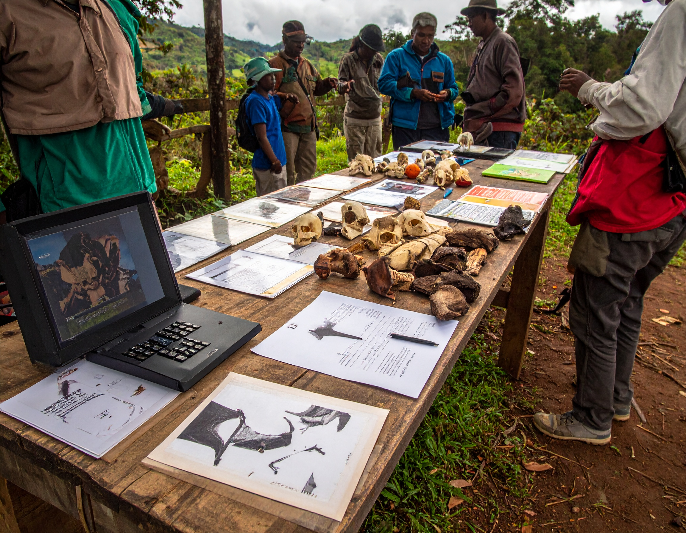

<h3 class="card-titulo">Innovación educativa y herramientas didácticas para la conservación de mamíferos</h3>

Laura Suárez Ramírez
María Angélica Contreras
Ginna Ruiz Burbano
Hernan Dario Granda Rodriguez
Johana Alejandra Villota Mogollón

La educación ambiental ha dejado de ser un contenido complementario en la conservación de la biodiversidad en Colombia para consolidarse como un eje estratégico en la construcción de territorios sostenibles y en el fortalecimiento de comunidades locales comprometidas y apropiadas de la biodiversidad que las rodea.

<a href="cursos/t4_innovacion/t4_innovacion.html" class="card-boton">Ver Taller Completo →</a>
</article>

<!-- TALLER REAL 5 -->
<article class="card-placeholder card-contenido">

<h3 class="card-titulo">Publique su Manuscrito en Mammalogy Notes</h3>

Diego J. Lizcano
Mauricio Vela

En la divulgación de resultados de investigación de mamíferos, la palabra escrita —en particular la literatura revisada por pares— sigue siendo fundamental.

<a href="cursos/t5_mammalogy/t5_mammalogy.html" class="card-boton">Ver Taller Completo →</a>
</article>

<!-- TALLER REAL 6 -->
<article class="card-placeholder card-contenido">

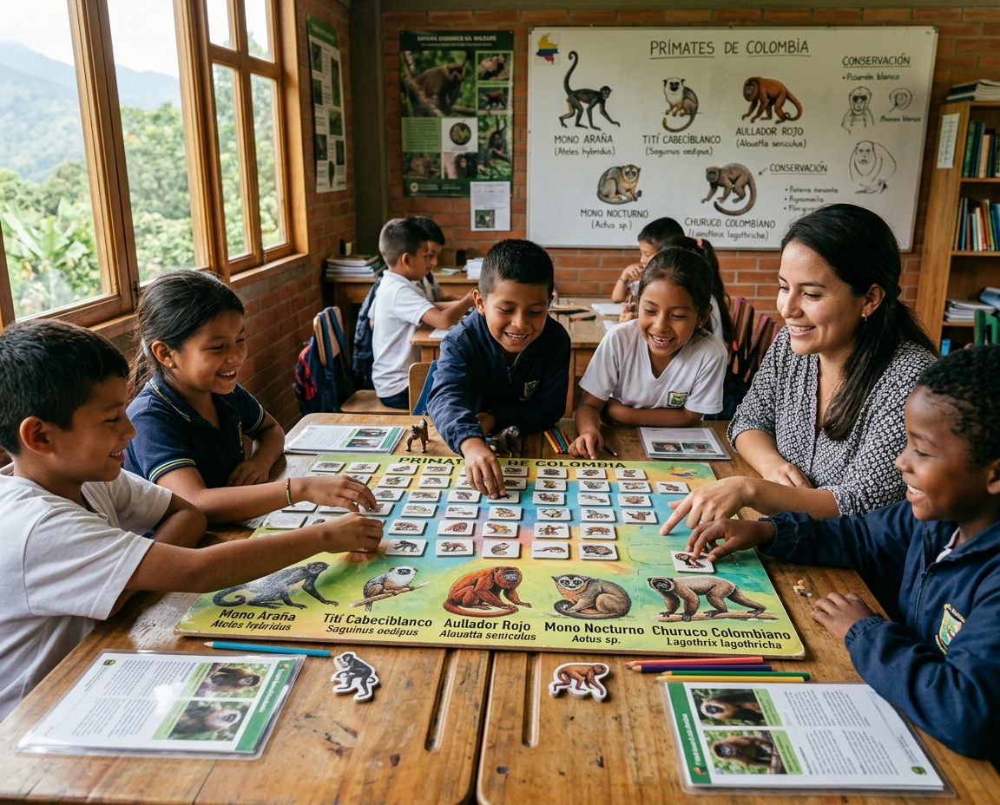

<h3 class="card-titulo">ConozcáMonos: aprende sobre ecología y conservación de monos de Colombia</h3>

Alma Hernández
Caralina Orrego

El orden Primates es uno de los más amenazados a nivel global principalmente por la pérdida de su hábitat, extracción como mascotas y cacería, la mayoría de las especies de monos están en alguna categoría de amenaza según la UICN.

<a href="cursos/t6_conozcamonos/t6_conozcamonos.html" class="card-boton">Ver Taller Completo →</a>
</article>

<!-- TALLER REAL 7 -->
<article class="card-placeholder card-contenido">

<h3 class="card-titulo">Mastogami: Animalitos en papel</h3>

Carolina López Castañeda

El primer taller de Mastozoogami Busca crear un espacio creativo,  inmersión dinámica entre el papel y la morfología básica de los mamíferos a través de la precisión del plegado.

<a href="cursos/t7_mastogami/t7_mastogami.html" class="card-boton">Ver Taller Completo →</a>
</article>

<!-- TALLER REAL 8 -->
<article class="card-placeholder card-contenido">

<h3 class="card-titulo">Guardianes del Territorio: Ciencia, Comunidades y Gestión Institucional.</h3>

Daniel Rodríguez
Andrés Felipe Vargas Arboleda
Stefania Gómez
Javier García

La creciente complejidad de los desafíos socioambientales en los territorios exige enfoques participativos que integren el conocimiento local, la gestión de la información y la toma de decisiones colaborativa.

<a href="cursos/t8_guardianes/t8_guardianes.html" class="card-boton">Ver Taller Completo →</a>
</article>

<!-- TALLER REAL 9 -->
<article class="card-placeholder card-contenido">

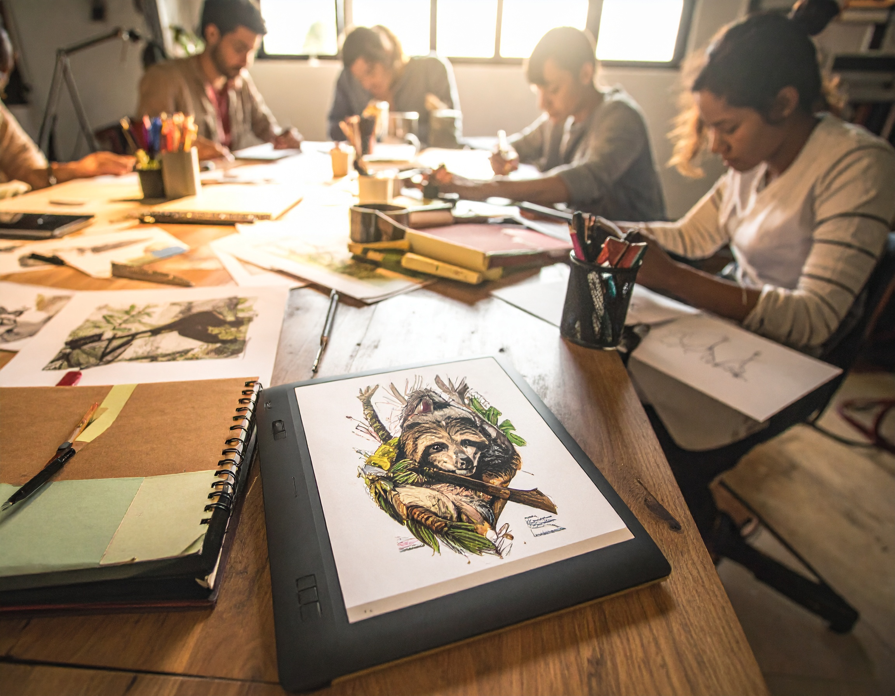

<h3 class="card-titulo">Del dato a la imagen: infografías narrativas con contexto territorial para la conservación de mamíferos</h3>

Yesyca Andrea López Bolaños
Nilsa Lorena Alvear 
Jhonier Apraez Bravo
Lina Maria Velasquez Caviche
Jhonny Rosero
Janssen Byron Sevilla Tintinago
Adrian Pazu Passu

En el contexto actual, uno de los principales retos de la mastozoología es lograr que el conocimiento científico trascienda de los espacios académicos y se conecte con diversos públicos de manera accesible, significativa y contextualizada.

<a href="cursos/t9_dato/t9_dato.html" class="card-boton">Ver Taller Completo →</a>
</article>

</section>

<!-- ==================== PRÓXIMOS EVENTOS ==================== -->
<section class="seccion-cursos">

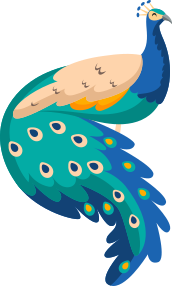
<h2>Próximos eventos</h2>

<article class="card-placeholder">

📅

<h3>Evento 1</h3>

Detalles del evento próximamente

Próximamente
</article>

<article class="card-placeholder">

📅

<h3>Evento 2</h3>

Detalles del evento próximamente

Próximamente
</article>

<article class="card-placeholder">

📅

<h3>Evento 3</h3>

Detalles del evento próximamente

Próximamente
</article>

</section>