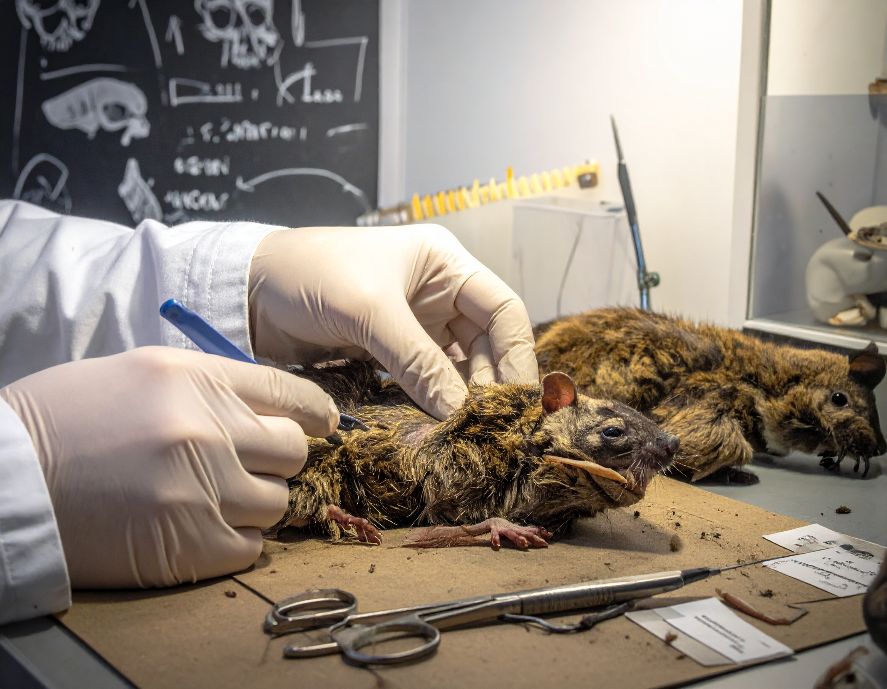

```{=html}
<section class="simposio-detalle-container">

<div class="detalle-breadcrumb">
<a href="../../index.html">⌂</a>
<span class="separator">›</span>
<a href="../../cursos.html">Cursos</a>
<span class="separator">›</span>
<span class="current">Colecciones a la comunidad</span>
</div>

<article class="detalle-card">
<div class="detalle-grid">

<div class="col-izquierda">
<div class="imagen-card">

<div class="pie-foto">
📷 Preparación de especímenes para colecciones biológicas y educación.
</div>
</div>

<div class="organizadores-info">
<h3>Organizan</h3>
<ul class="lista-organizadores">
<li>Manuela Alzate Lozada</li>
<li>Jaime Ramírez Mosquera</li>
<li>Natalia Ramírez Sáenz</li>
<li>Yesyca Andrea López Bolaños</li>
<li>Wilmar Guzmán Zapata</li>
<li>Lorena Alvear Narváez</li>
</ul>
<div class="badge-simposio">De las Colecciones a la Comunidad: Taxidermia como Herramienta de Educación Ambiental para la Conservación Biológica</div>
</div>
</div>

<div class="col-derecha">
<h1>De las Colecciones a la Comunidad: Taxidermia como Herramienta de Educación Ambiental para la Conservación Biológica</h1>
<div class="subtitulo">VI Congreso Colombiano de Mastozoología · Amazonía 2026</div>

<div class="objetivos">
<h2>Objetivos General</h2>
<p>Capacitar a los participantes en técnicas básicas de taxidermia en fauna (mamíferos) para la generación de recursos didácticos que fortalezcan procesos de educación ambiental y conservación biológica.</p>
<h2>Objetivos Especifícos</h2>
<ul class="lista-objetivos">
<li>Fortalecer técnicas básicas de preparación de especímenes cumpliendo con estándares de ética y bioseguridad.</li>
<li>Reconocer la importancia de las colecciones biológicas como centros de gestión de conocimiento, investigación y conservación.</li>
<li>Vincular los ejemplares preservados con narrativas de conservación, a partir de las cuales se fortalezca la apropiación social de conocimiento de la biodiversidad</li>
</ul>
</div>

<div class="resumen">
<h2>Resumen</h2>
<p>La taxidermia, tradicionalmente asociada a colecciones científicas, ha adquirido un papel relevante en procesos de educación ambiental al facilitar una aproximación directa al conocimiento de las especies que representan la biodiversidad de una región. En el contexto colombiano, reconocido como uno de los países megadiversos del mundo, estas herramientas cobran especial importancia ante los vacíos significativos del conocimiento y apropiación social de la fauna. </p>
<p>El estudio y conservación de los mamíferos requiere fortalecer procesos donde las colecciones biológicas sean un recurso fundamental para comprender la ecología, distribución y cambios de las especies en el tiempo (Bakker et al., 2020).</p>
<p>En este sentido, el uso de ejemplares preservados bajo estándares éticos y legales fortalece los procesos pedagógicos al integrar experiencias de aprendizaje sensoriales y directas, contribuyendo a la construcción de conocimiento y a la sensibilización ambiental, aspectos clave para la conservación (Ardoin et al., 2020; Cárdenas-González et al., 2021).</p>
<p>Este taller integra técnicas básicas de taxidermia de estudio con estrategias de comunicación científica para fortalecer la apropiación social del conocimiento sobre la mastofauna colombiana. De esta manera, se resalta el papel de las colecciones biológicas de museos como herramientas clave para la investigación, la educación y la conservación de la biodiversidad en el país.</p>

</div>

<a href="../../cursos.html" class="btn-volver">← Volver a todos los cursos</a>
</div>

</div>
</article>
</section>
```
<script src="c5_colecciones.js"></script>
