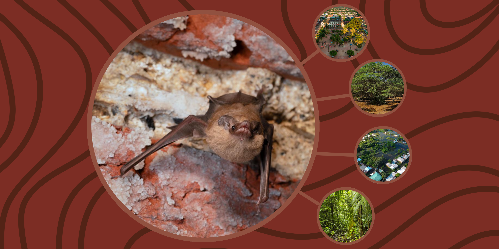

```{=html}
<section class="simposio-detalle-container">

<div class="detalle-breadcrumb">
<a href="../../index.html">⌂</a>
<span class="separator">›</span>
<a href="../../cursos.html">Talleres</a>
<span class="separator">›</span>
<span class="current">Refugios de Murciélagos</span>
</div>

<article class="detalle-card">
<div class="detalle-grid">

<div class="col-izquierda">
<div class="imagen-card">

<div class="pie-foto">
📷 Refugios de Murciélagos
</div>
</div>

<div class="organizadores-info">
<h3>Organizan</h3>
<ul class="lista-organizadores">
<li>Liceth Margarita Suárez Payares</li>
</ul>
<div class="badge-simposio">Introducción al Estudio de los Refugios de Murciélagos en Colombia</div>
</div>
</div>

<div class="col-derecha">
<h1>Introducción al Estudio de los Refugios de Murciélagos en Colombia</h1>
<div class="subtitulo">VI Congreso Colombiano de Mastozoología · Amazonía 2026</div>

<div class="objetivos">
<h2>Objetivos General</h2>
<ul class="lista-objetivos">
<li>Presentar aspectos generales acerca de los Refugios de Murciélagos Neotropicales, y su realidad en América Latina y el Caribe.</li>
<li>Aproximar algunas metodologías implementadas en el estudio de los Refugios de Murciélagos.</li>
<li>Presentar un panorama actual acerca del estudio de los Refugios de Murciélagos en Colombia.</li>
</ul>
<h2>Objetivos de Aprendizaje</h2>
<ul class="lista-objetivos">
<li>Identificar qué es un refugio de murciélagos, y cuáles son las estructuras empleadas para dicho fin.</li>
<li>Identificar y reconocer las principales estructuras utilizadas como refugio, por las nueve familias de murciélagos que habitan el Neotrópico.</li>
<li>Identificar algunas metodologías empleadas en campo, para la detección, observación y el estudio, de los refugios de murciélagos, y de los murciélagos en refugios.</li>
<li>Reconocer la importancia de los refugios, para la conservación de los murciélagos, y otras áreas de gestión, y el panorama actual de su estudio en Colombia.</li>
</ul>
</div>

<div class="resumen">
<h2>Resumen</h2>
<p>Los refugios de murciélagos son elementos cruciales en la dinámica ecosistémica neotropical, su estudio y comprensión permite el acercamiento a escala fina, de fenómenos que escapan, en muchas ocasiones, de nuestra vista, pero que podrían tener un impacto al alcance de todos. Es por ello, que consideramos de suma importancia el avance, la permanencia, y la periodicidad de su estudio en el país, y presentamos, para ser llevado a cabo en el marco del VI Congreso Colombiano de Mastozoología, el I Taller de Introducción al Estudio de los Refugios de Murciélagos Neotropicales en Colombia, espacio que considerará aspectos generales acerca de estos sitios, qué ha sido de su estudio en el país, desde las primeras publicaciones de las cuales se tiene registro, y su importancia y relevancia para la toma de decisiones y para el alcance de objetivos globales para reducir la pérdida de biodiversidad. </p>

</div>

<a href="../../cursos.html" class="btn-volver">← Volver a todos los talleres</a>
</div>

</div>
</article>
</section>
```
<script src="t2_murcielagos.js"></script>
