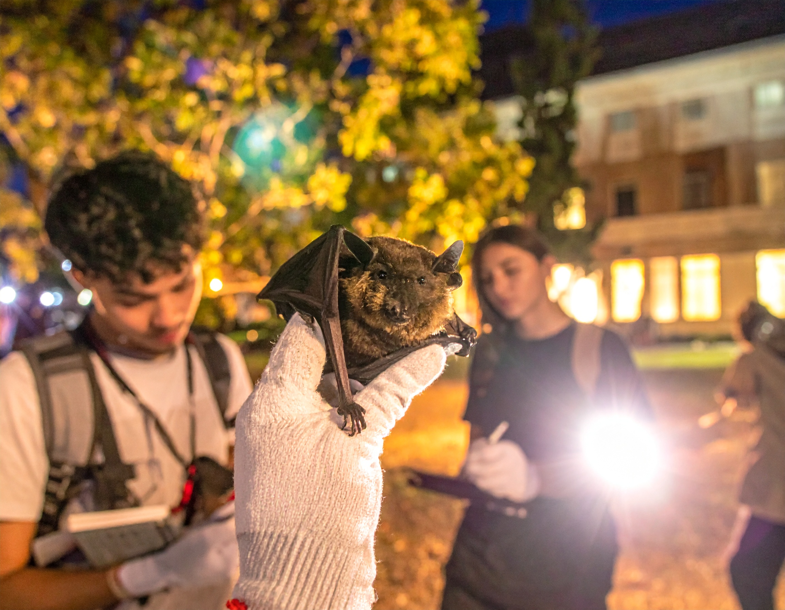

```{=html}
<section class="simposio-detalle-container">

<div class="detalle-breadcrumb">
<a href="../../index.html">⌂</a>
<span class="separator">›</span>
<a href="../../cursos.html">Talleres</a>
<span class="separator">›</span>
<span class="current">Murcielloween</span>
</div>

<article class="detalle-card">
<div class="detalle-grid">

<div class="col-izquierda">
<div class="imagen-card">

<div class="pie-foto">
📷 Ciencia participativa para la conservación de murciélagos en contextos urbanos.
</div>
</div>

<div class="organizadores-info">
<h3>Organizan</h3>
<ul class="lista-organizadores">
<li>Kevin Alexander Ramírez</li>
<li>Joseph Alejandro Romero</li>
<li>Cesar Camilo Castillo</li>
<li>Charles S. Muñoz Nates</li>
</ul>
<div class="badge-simposio">Murcielloween: Investigación participativa para la conservación de murciélagos en entornos urbanos</div>
</div>
</div>

<div class="col-derecha">
<h1>Murcielloween: Investigación participativa para la conservación de murciélagos en entornos urbanos</h1>
<div class="subtitulo">VI Congreso Colombiano de Mastozoología · Amazonía 2026</div>

<div class="objetivos">
<h2>Objetivos General</h2>
<p>Promover el conocimiento y la valoración de la quiropterofauna en entornos urbanos mediante una iniciativa participativa que fomente la sensibilización y participación activa de la comunidad universitaria y de la sociedad en general.</p>
<h2>Objetivos Especifícos</h2>
<ul class="lista-objetivos">
<li>Caracterizar la composición de especies de murciélagos presentes en el ambiente urbano de estudio, a través de la implementación de muestreo e identificación taxonómica.</li>
<li>Fomentar la concientización sobre la importancia ecológica de los murciélagos y su rol funcional en los ecosistemas urbanos.</li>
<li>Incentivar la participación de la comunidad en general en procesos de aprendizaje y apropiación social del conocimiento sobre la quiropterofauna.</li>
</ul>
</div>

<div class="resumen">
<h2>Resumen</h2>
<p>El taller "Murcielloween", surge como una iniciativa de ciencia participativa desarrollada por la Universidad del Cauca para generar conocimiento sobre los murciélagos en entornos urbanos, dada la escasez de información sobre la quiropterofauna del campus y la necesidad de valorar este grupo biológico. Su objetivo general es promover el conocimiento y la valoración de los murciélagos mediante la sensibilización y participación activa de la comunidad universitaria y la sociedad. Específicamente, busca caracterizar las especies presentes a través de muestreo e identificación taxonómica, fomentar la concientización sobre su importancia ecológica e incentivar la participación comunitaria en procesos de aprendizaje. La justificación parte de que la sensibilización hacia fauna estigmatizada es clave para la conservación, ofreciendo una experiencia teórico-práctica que derriba mitos y genera actitudes proactivas, proyectándose como recurso pedagógico replicable. La metodología combina tres momentos: una charla interactiva de desestigmatización, un acercamiento perceptual con especímenes de exhibición y una introducción al instrumental técnico. Luego se realizan salidas de campo con redes de niebla además del registro morfológico de individuos, construcción de base de datos y elaboración de fichas técnicas. La estrategia es inclusiva con una convocatoria abierta sin requisitos previos, roles diversos para vincular personas con diferentes capacidades y espacios formativos con lenguaje accesible, fortaleciendo así el vínculo entre ciencia y sociedad.</p>

</div>

<a href="../../cursos.html" class="btn-volver">← Volver a todos los talleres</a>
</div>

</div>
</article>
</section>
```
<script src="t3_murcielloween.js"></script>
