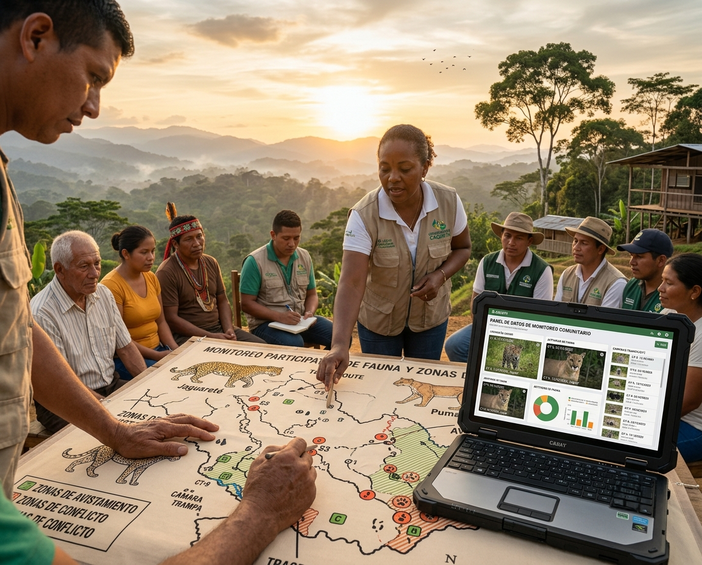

```{=html}
<section class="simposio-detalle-container">

<div class="detalle-breadcrumb">
<a href="../../index.html">⌂</a>
<span class="separator">›</span>
<a href="../../cursos.html">Talleres</a>
<span class="separator">›</span>
<span class="current">Guardianes del territorio</span>
</div>

<article class="detalle-card">
<div class="detalle-grid">

<div class="col-izquierda">
<div class="imagen-card">

<div class="pie-foto">
📷 Diálogo de saberes para la gobernanza territorial y la coexistencia.
</div>
</div>

<div class="organizadores-info">
<h3>Organizan</h3>
<ul class="lista-organizadores">
<li>Daniel Rodríguez</li>
<li>Andrés Felipe Vargas Arboleda</li>
<li>Stefania Gómez</li>
<li>Javier García</li>
</ul>
<div class="badge-simposio">Guardianes del Territorio: Ciencia, Comunidades y Gestión Institucional.</div>
</div>
</div>

<div class="col-derecha">
<h1>Guardianes del Territorio: Ciencia, Comunidades y Gestión Institucional.</h1>
<div class="subtitulo">VI Congreso Colombiano de Mastozoología · Amazonía 2026</div>

<div class="objetivos">
<h2>Objetivos Especifícos</h2>
<ul class="lista-objetivos">
<li>Comprender los principios y alcances del Monitoreo Comunitario Participativo (MCP) como herramienta para la toma de decisiones informadas y la gobernanza territorial.</li>
<li>Identificar factores clave como la confianza, la comunicación y el uso pertinente de tecnologías para la sostenibilidad de procesos de conservación comunitaria.</li>
<li>Analizar enfoques de coexistencia socio-ecológica que favorezcan la tolerancia y el apoyo comunitario hacia la biodiversidad, incluyendo especies de alta conflictividad como grandes carnívoros.</li>
<li>Reconocer experiencias exitosas de participación comunitaria que hayan fortalecido simultáneamente la seguridad de las personas y la conservación de la biodiversidad.</li>
<li>Reflexionar sobre estrategias para la gestión de datos e información aplicadas a la gobernanza y la planeación territorial en contextos locales.</li>
<li>Proponer acciones o rutas de aplicación de estas herramientas en sus propios territorios, proyectos o líneas de investigación. </li>
<li>Fomentar un espacio de intercambio y aprendizaje sobre el Monitoreo Comunitario Participativo (MCP) como herramienta estratégica para la gobernanza territorial y la coexistencia entre las comunidades campesinas y la fauna silvestre</li>
</ul>
</div>

<div class="resumen">
<h2>Resumen</h2>
<p>La creciente complejidad de los desafíos socioambientales en los territorios exige enfoques participativos que integren el conocimiento local, la gestión de la información y la toma de decisiones colaborativa. En este contexto, resulta fundamental visibilizar y discutir experiencias que demuestran cómo el monitoreo comunitario participativo, el fortalecimiento de la confianza entre actores, el uso adecuado de tecnologías y estrategias de comunicación, así como los modelos de coexistencia socio-ecológica, pueden contribuir de manera efectiva a la conservación de la biodiversidad y al bienestar de las comunidades.</p>
<p>Este taller se plantea como un espacio académico y práctico dentro del congreso para intercambiar aprendizajes, presentar casos exitosos y reflexionar sobre propuestas innovadoras de gobernanza territorial y planeación basada en datos. De esta manera, se busca promover herramientas y alianzas que fortalezcan el liderazgo local, mejoren la seguridad socioambiental y consoliden procesos sostenibles de conservación comunitaria en diversos contextos territoriales.</p>

</div>

<a href="../../cursos.html" class="btn-volver">← Volver a todos los talleres</a>
</div>

</div>
</article>
</section>
```
<script src="t8_guardianes.js"></script>
