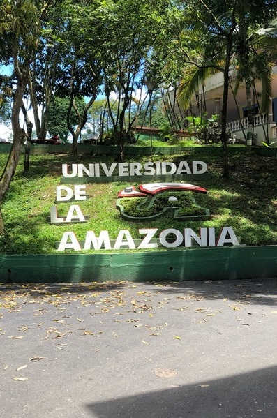
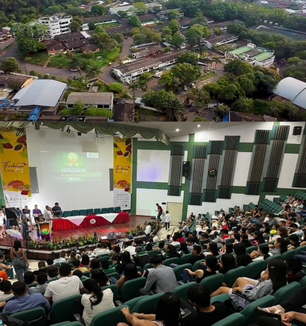

```{=html}
<section class="home-hero">
  <div class="hero-overlay"></div>
  <div class="hero-inner">
    <div class="hero-badge reveal">Amazonía 2026 · Florencia, Caquetá</div>
    <h1 class="hero-title reveal">VICCM Florencia</h1>
    <p class="hero-subtitle reveal">
      Sexto Congreso Colombiano de Mastozoología · 2 al 6 de noviembre de 2026
    </p>

    <div class="hero-actions reveal">
      <a href="https://mamiferoscolombia.org/Membresia/" target="_blank" rel="noopener noreferrer" class="hero-btn hero-btn-primary">
        Inscríbete
      </a>
      <a href="noticias.html" class="hero-btn hero-btn-secondary">
        Ver noticias
      </a>
    </div>
  </div>

  <div class="hero-scroll-indicator">
    <span></span>
  </div>
</section>

<section class="home-intro section-block">
  <div class="section-shell intro-shell">
    <div class="intro-copy reveal">
      <span class="section-kicker">Bienvenidos</span>
      <h2 class="section-heading">La mastozoología colombiana se encuentra en la Amazonía</h2>
      <p>
        El Congreso Colombiano de Mastozoología se celebra cada dos años y sus sedes se alternan de manera itinerante en distintas regiones biogeográficas de Colombia, con el propósito de visibilizar la riqueza natural y cultural de cada territorio, así como fortalecer el desarrollo de las distintas formas de construcción de conocimiento y de gestión de la biodiversidad de mamíferos.
      </p>
      <p>
        Para esta sexta edición la sede será la Amazonía colombiana, una región reconocida mundialmente por su extraordinaria biodiversidad y por ser el hogar de comunidades que han tejido una relación profunda con la naturaleza.
      </p>
    </div>

    <div class="intro-highlight reveal">
      <div class="highlight-card">
        <div class="highlight-number"></div>
        <div class="highlight-text">
          <strong>VI Congreso Colombiano</strong>
          <span>Un espacio para ciencia, territorio, biodiversidad y saberes compartidos.</span>
        </div>
      </div>
    </div>
  </div>
</section>

<section class="home-news section-block">
  <div class="section-shell">
    <div class="section-header reveal">
      <span class="section-kicker">Actualidad</span>
      <h2 class="section-heading">Últimas Noticias</h2>
      <p class="section-description">Consulta convocatorias, circulares y anuncios más recientes del congreso.</p>
    </div>

    <div class="news-grid">
      <article class="news-card reveal">
        <div class="news-image">
          
        </div>
        <div class="news-content">
          <span class="news-date">06 Abril 2026</span>
          <h3>Concurso de Diseño</h3>
          <p>Consúlten las bases del concurso de Diseno para participar en el VICCM 2026.</p>
          <a href="noticias/2026-04-06_Concurso_Diseno/concurso_diseno.html" class="news-link">Leer más</a>
        </div>
      </article>

      <article class="news-card reveal">
        <div class="news-image">
          
        </div>
        <div class="news-content">
          <span class="news-date">01 Febrero 2026</span>
          <h3>Segunda Circular</h3>
          <p>Ya está disponible la segunda circular con información actualizada del congreso.</p>
          <a href="noticias/2026-02-01_segunda_circular/segunda_circular.html" class="news-link">Leer más</a>
        </div>
      </article>

      <article class="news-card reveal">
        <div class="news-image">
          
        </div>
        <div class="news-content">
          <span class="news-date">26 Enero 2026</span>
          <h3>Premios y Reconocimientos</h3>
          <p>Conoce las categorías de premios y reconocimientos del VI Congreso Colombiano de Mastozoología.</p>
          <a href="noticias/2026-01-26_premios/premios.html" class="news-link">Leer más</a>
        </div>
      </article>
    </div>

    <div class="quick-icons reveal">
      <div class="quick-icon-card">
        <div class="quick-icon">🎤</div>
        <span>Conferencistas</span>
      </div>
      <div class="quick-icon-card">
        <div class="quick-icon">📅</div>
        <span>Fechas clave</span>
      </div>
      <div class="quick-icon-card">
        <div class="quick-icon">🌿</div>
        <span>Eventos</span>
      </div>
    </div>
  </div>
</section>

<section class="home-abstracts section-block">
  <div class="section-shell abstracts-shell">
    <div class="abstracts-copy reveal">
      <span class="section-kicker light">Participación Académica</span>
      <h2 class="section-heading light">Resúmenes</h2>
      <p class="section-description light">
        Prepara y envía tu resumen a través de la plataforma oficial del congreso.
      </p>
    </div>

    <div class="abstracts-grid">
      <div class="abstract-card reveal">
        <div class="abstract-icon">📝</div>
        <h3>Preparar Resumen</h3>
        <p>Guías y plantillas para preparar correctamente tu propuesta académica.</p>
        <a href="https://mamiferoscolombia.org/openconf/openconf.php" target="_blank" rel="noopener noreferrer" class="abstract-btn">
          Preparar
        </a>
      </div>

      <div class="abstract-card reveal">
        <div class="abstract-icon">📤</div>
        <h3>Enviar Resumen</h3>
        <p>Accede a la plataforma oficial para enviar tu resumen al VICCM 2026.</p>
        <a href="https://mamiferoscolombia.org/openconf/openconf.php" target="_blank" rel="noopener noreferrer" class="abstract-btn">
          Enviar
        </a>
      </div>
    </div>
  </div>
</section>

<section class="home-register section-block">
  <div class="section-shell">
    <div class="register-card reveal">
      <div class="register-icon">✍️</div>
      <h2>¡Inscríbete Ahora!</h2>
      <p>Asegura tu participación en el congreso más importante de mastozoología en Colombia.</p>
      <a href="https://mamiferoscolombia.org/Membresia/" target="_blank" rel="noopener noreferrer" class="register-btn">
        INSCRÍBETE AQUÍ
      </a>
    </div>
  </div>
</section>

<section class="home-venue section-block">
  <div class="section-shell">
    <div class="section-header reveal">
      <span class="section-kicker">Sede</span>
      <h2 class="section-heading">Ubicación del Congreso</h2>
      <p class="section-description">Universidad de la Amazonia · Florencia, Caquetá</p>
    </div>

    <div class="venue-grid">
      <div class="venue-gallery reveal">
        <div class="venue-slider" id="venueSlider">
          
          
          
        </div>
        <div class="venue-dots" id="venueDots"></div>
      </div>

      <div class="venue-map reveal">
        <iframe
          src="https://www.google.com/maps/embed?pb=!1m18!1m12!1m3!1d4730.82210175032!2d-75.60683052432172!3d1.62013236064601!2m3!1f0!2f0!3f0!3m2!1i1024!2i768!4f13.1!3m3!1m2!1s0x8e244e2307a3b2af%3A0x2eb9e14897cad6c7!2sUniversidad%20de%20la%20Amazonia%20sede%20principal!5e1!3m2!1ses!2sco!4v1775502218616!5m2!1ses!2sco"
          loading="lazy"
          referrerpolicy="no-referrer-when-downgrade"
          allowfullscreen="">
        </iframe>
      </div>
    </div>
  </div>
</section>

<section class="home-values section-block">
  <div class="section-shell">
    <div class="section-header reveal">
      <span class="section-kicker">Nuestros valores</span>
      <h2 class="section-heading">Nosotros Valoramos</h2>
      <p class="section-description">Principios que orientan la experiencia del VICCM 2026.</p>
    </div>

    <div class="values-grid">
      <article class="value-card reveal">
        <div class="value-icon">🤝</div>
        <h3>La Integridad</h3>
        <p>
          El intercambio abierto de ideas y la libertad de pensamiento y expresión son fundamentales para los objetivos y metas del VICCM 2026; estos requieren un entorno que reconozca el valor inherente de cada persona y grupo, que fomente la dignidad, la comprensión y el respeto mutuo, y que abrace la diversidad.
        </p>
      </article>

      <article class="value-card reveal">
        <div class="value-icon">🔎</div>
        <h3>Transparencia Científica</h3>
        <p>
          La transparencia es necesaria para una ciencia reproducible. Promovemos que las decisiones, los métodos y los protocolos sean claros, transparentes y reproducibles, desde la fase de planificación hasta el análisis y resultado final.
        </p>
      </article>

      <article class="value-card reveal">
        <div class="value-icon">🧪</div>
        <h3>Métodos Robustos</h3>
        <p>
          Ningún método ni procedimiento analítico es perfecto. Valoramos la consideración de las fortalezas y limitaciones de cada método o análisis, favoreciendo resultados sólidos y decisiones informadas.
        </p>
      </article>
    </div>
  </div>
</section>
```