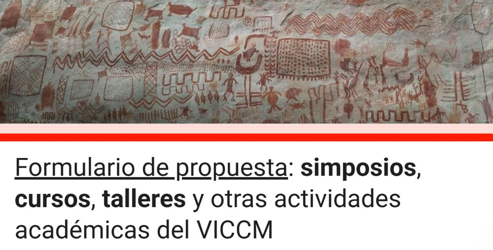
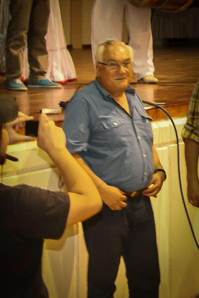

<section class="noticias-hero">

<h1>Noticias del Congreso</h1>

Entérate de las últimas novedades, convocatorias y actualizaciones del VICCM 2026

</section>

<section class="noticias-page">

<button class="filtro-btn active" data-categoria="todas" type="button">Todas</button>
<button class="filtro-btn" data-categoria="convocatorias" type="button">Convocatorias</button>
<button class="filtro-btn" data-categoria="circulares" type="button">Circulares</button>
<button class="filtro-btn" data-categoria="premios" type="button">Premios</button>
<button class="filtro-btn" data-categoria="conducta" type="button">Código de Conducta</button>

🔎
<input type="text" class="busqueda-input" placeholder="Buscar noticias..." id="busquedaInput">

6 Abr

6 Abril 2026
5:00 p.m

Catalina Concha-Osbahr
Javier García-Villalba

<h3 class="noticia-titulo">Concurso de Diseño</h3>

Consúlten las bases del concurso de diseño para participar en el VICCM 2026.

<a href="noticias/2026-04-06_Concurso_Diseno/concurso_diseno.html" class="noticia-btn">Ver Noticia Completa →</a>

9 Feb

9 Febrero 2026
8:00 a.m

Catalina Concha-Osbahr
Javier García-Villalba

<h3 class="noticia-titulo">Enviar Propuesta Simposio</h3>

Diligencie el formulario para enviar propuestas de simposios, talleres, mesas redondas, cursos y otras actividades académicas del VICCM.

<a href="noticias/2026-02-09_Formulario/formulario.html" class="noticia-btn">Ver Noticia Completa →</a>

1 Feb

1 Febrero 2026
10:00 a.m

Catalina Concha-Osbahr

<h3 class="noticia-titulo">Segunda Circular</h3>

El Comité Organizador del VICCM invita a presentar propuestas para la realización de simposios, talleres, mesas redondas, cursos y otras actividades académicas del VICCM.

<a href="noticias/2026-02-01_segunda_circular/segunda_circular.html" class="noticia-btn">Ver Noticia Completa →</a>

28 Ene

28 Enero 2026
8:25 a.m

Catalina Concha-Osbahr

<h3 class="noticia-titulo">Primera Circular</h3>

El Comité Organizador del VICCM presenta oficialmente el VI Congreso Colombiano de Mastozoología, que se realizará en Florencia, Caquetá, con la Universidad de la Amazonia como institución anfitriona.

<a href="noticias/2026-01-28_primera_circular/primera_circular.html" class="noticia-btn">Ver Noticia Completa →</a>

26 Ene

26 Enero 2026
8:48 a.m

Diego J. Lizcano

<h3 class="noticia-titulo">Premios</h3>

El VICCM ofrece varios premios, incluyendo uno a la mejor presentación oral y al mejor poster de un estudiante.

<a href="noticias/2026-01-26_premios/premios.html" class="noticia-btn">Ver Noticia Completa →</a>

25 Ene

25 Enero 2026
10:48 a.m

Diego J. Lizcano

<h3 class="noticia-titulo">Código de conducta, VICCM 2026</h3>

Los participantes que infrinjan estas normas podrán ser denunciados, sancionados y expulsados del congreso.

<a href="noticias/2026-01-25_codigo_de_conducta/codigo_conducta.html" class="noticia-btn">Ver Noticia Completa →</a>

<ul>
<li><a href="#" class="page-item active">1</a></li>
<li><a href="#" class="page-item">2</a></li>
<li><a href="#" class="page-item">3</a></li>
<li><a href="#" class="page-item">→</a></li>
</ul>

</section>

<section class="newsletter-section">

<h2>📬 Recibe nuestras noticias</h2>

Suscríbete para recibir las últimas actualizaciones del congreso directamente en tu correo

<input type="email" class="newsletter-input" placeholder="Tu correo electrónico">
<button class="newsletter-btn" type="button">Suscribirme</button>

</section>
