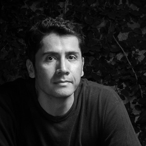
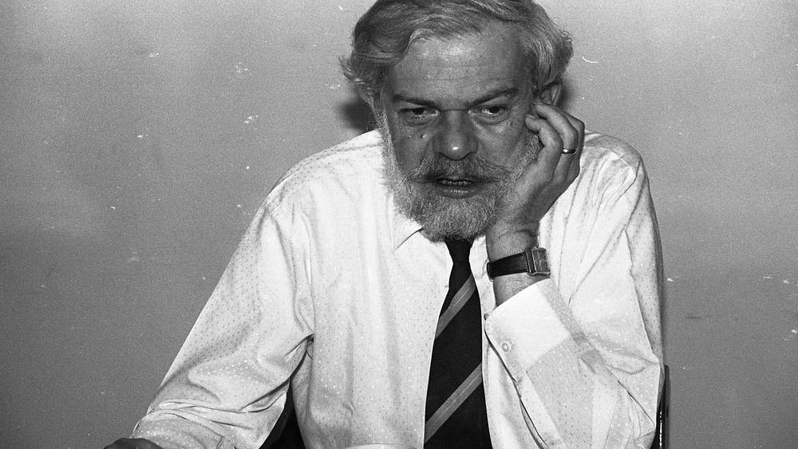
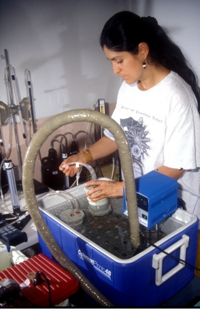

```{=html}
<section class="premios-detalle-container">

<div class="detalle-breadcrumb">
<a href="../../index.html">⌂</a>
<span class="separator">›</span>
<a href="../../noticias.html">Noticias</a>
<span class="separator">›</span>
<span class="current">Premios VICCM 2026</span>
</div>

<article class="detalle-card">

<div class="detalle-header">
<div class="detalle-header-content">
<span class="detalle-categoria">Premios y Reconocimientos</span>
<h1 class="detalle-titulo">Premios VICCM 2026</h1>
<div class="detalle-meta">
<span>26 Enero 2026</span>
<span>8:48 a.m</span>
</div>
</div>
</div>

<div class="detalle-body">

<a class="autor-destacado" href="../../comites.html">
<div class="autor-avatar">

</div>
<div class="autor-info">
<h3>Diego J. Lizcano</h3>
<p>Autor de la noticia</p>
<small>Haz clic para ver el comité</small>
</div>
</a>

<section class="premio-seccion">
<h2 class="premio-titulo-seccion">Premio a mejor presentación oral y mejor póster</h2>
<div class="premio-texto">
<p>Una propuesta es elegible para el premio de mejor presentación de un estudiante solo si el/los autor(es) principal(es) es(son) estudiante(s) y en el momento de la presentación, presenta el estudiante. Además, una parte significativa del trabajo debe haber sido realizada por dicho/s estudiante(s). La elegibilidad al premio de estudiante se puede indicar en el momento de someter el resumen.</p>
<p>El Comité Científico podrá seleccionar varias propuestas elegibles para una lista corta. La decisión final se tomará en consulta en el Comité de científico. El premio se anunciará y entregará durante la sesion de clausura del VICCM.</p>
</div>
</section>

<section class="premio-seccion">
<h2 class="premio-titulo-seccion">Premio Jorge Ignacio “El Mono” Hernández</h2>
<div class="premio-texto">
<p>En reconocimiento a la labor en conservación de mamíferos.</p>
<p>Jorge Ignacio Hernández-Camacho, mejor conocido como “El Mono” Hernández fue un eminente naturalista y mastozoologo que trabajó para crear las primeras áreas protegidas en Colombia, y es considerado padre de los parques nacionales naturales de Colombia.</p>
</div>

<figure class="foto-premio foto-ancha">

<figcaption>Foto: Jorge Ignacio “El Mono” Hernández. Foto de Colprensa.</figcaption>
</figure>
</section>

<section class="premio-seccion">
<h2 class="premio-titulo-seccion">Premio Alberto Cadena-García</h2>
<div class="premio-texto">
<p>En reconocimiento a la labor mastozoológica.</p>
<p>Alberto Cadena-García fue jefe de la Unidad de Mastozoología del Instituto de Ciencias Naturales (ICN) de la Universidad Nacional desde 1975 hasta su retiro en el año 2000. La colección de Mamíferos del ICN lleva su nombre.</p>
</div>

<figure class="foto-premio foto-vertical">

<figcaption>Foto: Alberto Cadena-García. Primer congreso de Mastozoología, Quibdó, Chocó 2011.</figcaption>
</figure>
</section>

<section class="premio-seccion">
<h2 class="premio-titulo-seccion">Premio Adriana Ruíz-Espinosa</h2>
<div class="premio-texto">
<p>En reconocimiento a un estudiante destacado en mastozoología.</p>
<p>Adriana Ruíz-Espinosa fue una carismatica y reconocida investigadora colombiana dedicada principalmente al estudio de los murciélagos. Adriana estudió Biología en la Universidad de los Andes en Bogotá, y realizó sus posgrados (maestría y doctorado) en la Universidad de los Andes, en Merida, Venezuela. Adriana aportó significativamente a la formación de estudiantes desde su posición como profesora en la Universidad del Valle. Adriana fue Vicepresidenta y fundadora de la Sociedad Colombiana de Mastozoología. Una especie de murciélago lleva su nombre: Sturnira adrianae.</p>
</div>

<figure class="foto-premio foto-vertical">

<figcaption>Foto: Adriana Ruíz-Espinosa en su laboratorio de la Universidad del Valle en Cali.</figcaption>
</figure>
</section>

<div class="detalle-nav">
<a href="../2026-01-25_codigo_de_conducta/codigo_conducta.html">
<div class="label">Anterior</div>
<div class="title">Código de Conducta</div>
</a>

<a href="../2026-01-28_primera_circular/primera_circular.html" class="next">
<div class="label">Siguiente</div>
<div class="title">Primera Circular</div>
</a>
</div>

</div>
</article>
</section>
```

<script src="premios.js"></script>
