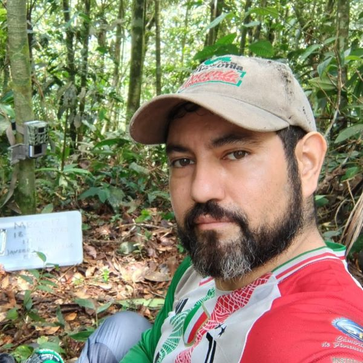
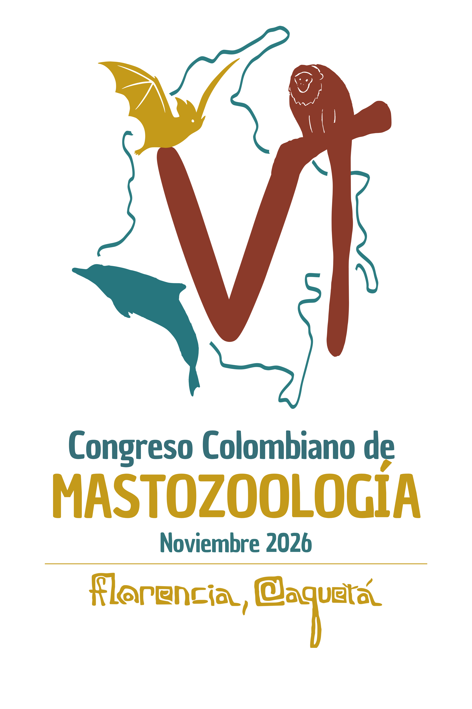

```{=html}
<section class="noticia-container">

<div class="detalle-breadcrumb">
<a href="../../index.html">⌂</a>
<span class="separator">›</span>
<a href="../../noticias.html">Noticias</a>
<span class="separator">›</span>
<span class="current">Ganador Concurso Logo</span>
</div>

<article class="noticia-card">

<div class="noticia-header">
<div class="noticia-header-content">
<h1 class="noticia-titulo">Ganador Concurso Logo</h1>

<div class="noticia-meta">
<span>14 Julio 2026</span>
</div>
</div>
</div>

<div class="noticia-body">

<a class="autor-destacado" href="../../comites.html">
<div class="autor-avatar">

</div>
<div class="autor-info">
<h3>Javier García</h3>
<p>Presidente VICCM</p>
<small>Haz clic para ver el comité</small>
</div>
</a>

<h2>Resultados del Concurso</h2>

<p>El concurso para el diseño del logo oficial del VI Congreso Colombiano de Mastozoología (VICCM 2026) se realizó con éxito y contó con la participación de 10 propuestas. Este proceso permitió reconocer distintas formas de representar, desde el diseño y la creatividad, la relación entre la mastozoología, la Amazonia, la biodiversidad y la identidad territorial del Congreso.</p>

<h2>Sobre el Logo Ganador</h2>

<p>El logo ganador integra elementos representativos de la diversidad natural y cultural del Caquetá y la Amazonia colombiana.</p>

<p>Su diseño reconoce a Florencia y al Caquetá como "Puerta de Oro de la Amazonia Colombiana", incorporando referencias a la memoria rupestre amazónica, especies emblemáticas y una paleta cromática inspirada en la luz, el agua, la tierra amazónica y los mamíferos:</p>

<ul class="lista-viñetas especies-emblematicas">
<li><em>Plecturocebus caquetensis</em></li>
<li><em>Inia geoffrensis</em></li>
<li><em>Lonchorhina marinkellei</em></li>
</ul>

<p>La propuesta dialoga con el lema del Congreso, "Amazonia sin fronteras: tejiendo saberes, biodiversidad y conocimiento", al articular ciencia, territorio, arte y memoria cultural. Este logo representará la identidad visual del VICCM 2026 y será aplicado en las piezas gráficas, documentos y materiales institucionales del Congreso, con los ajustes técnicos necesarios para garantizar su correcta reproducción en distintos formatos y soportes.</p>

<div class="logo-galeria">
<div class="logo-item">

<span class="logo-label">Versión vertical</span>
</div>
<div class="logo-item">

<span class="logo-label">Versión horizontal</span>
</div>
</div>

<h2>Conoce a la Autora</h2>

<div class="ganadora-card">
<div class="ganadora-avatar">

</div>
<div class="ganadora-info">
<h3>Salomé Valencia Muñetón</h3>
<p>La propuesta ganadora fue diseñada por Salomé Valencia Muñetón, bióloga, con interés en la mastozoología, la educación ambiental y la divulgación científica a través del arte. Hace parte del equipo del Sistema Local de Áreas Protegidas de Sabaneta (SILAP), donde lidera procesos de monitoreo de fauna silvestre, educación ambiental y articulación con actores del territorio. Su trabajo busca acercar la ciencia a las personas mediante experiencias creativas y participativas, promoviendo el conocimiento, la apropiación y el cuidado de la biodiversidad.</p>
</div>
</div>

<div class="invitacion-especial">
<p>¡Felicitamos a Salomé por su valioso aporte a la identidad visual del VICCM 2026!</p>
</div>

<div class="detalle-nav">

<a href="../2026-07-14_tercera_circular/tercera_circular.html">
<div class="label">Anterior</div>
<div class="title">Tercera Circular</div>
</a>

<a href="../2026-04-06_Concurso_Diseno/concurso_diseno.html" class="next">
<div class="label">Siguiente</div>
<div class="title">Concurso Diseño</div>
</a>

</div>

</div>
</article>
</section>
```

<script src="ganador_logo.js"></script>
