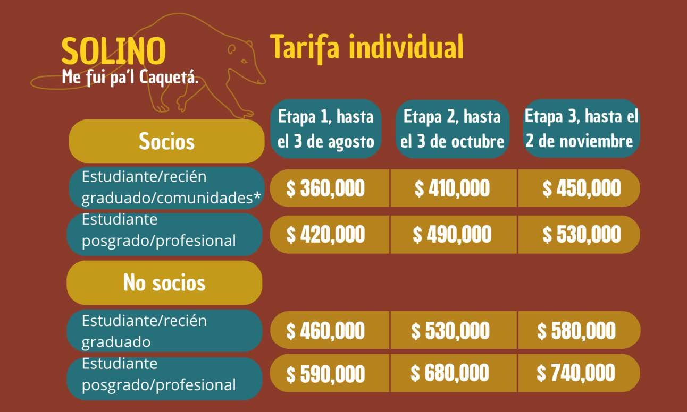
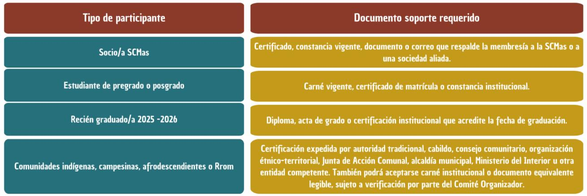
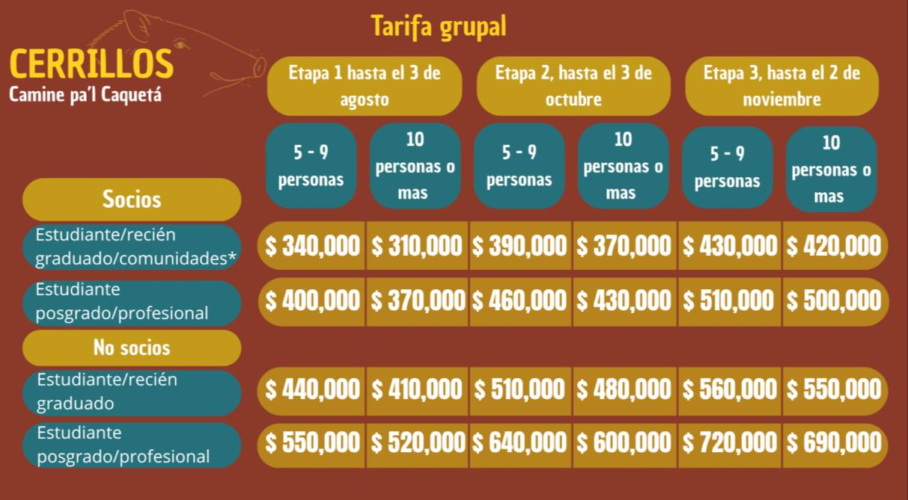
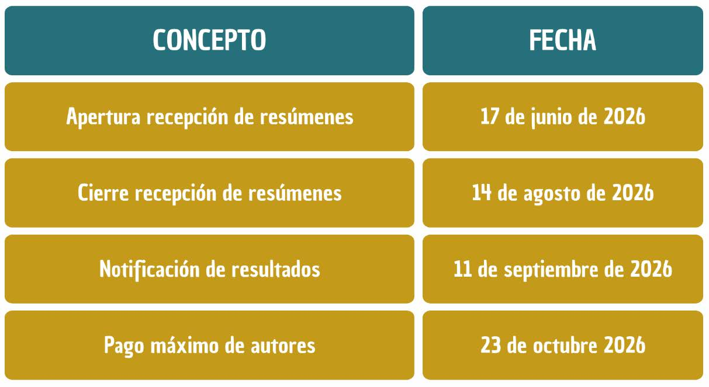

```{=html}
<section class="noticia-container">

<div class="detalle-breadcrumb">
<a href="../../index.html">⌂</a>
<span class="separator">›</span>
<a href="../../noticias.html">Noticias</a>
<span class="separator">›</span>
<span class="current">Tercera Circular</span>
</div>

<article class="noticia-card">

<div class="noticia-header">
<div class="noticia-header-content">
<h1 class="noticia-titulo">Tercera Circular</h1>
<div class="noticia-meta">
<span>15 Julio 2026</span>
<span>5:00 p.m</span>
</div>
</div>
</div>

<div class="noticia-body">

<a class="autor-destacado" href="../../comites.html">
<div class="autor-avatar">

</div>
<div class="autor-info">
<h3>Catalina Concha Osbahr</h3>
<p>Autora de la noticia</p>
<small>Haz clic para ver el comité</small>
</div>
</a>
<h2 class="apertura">APERTURA DE INSCRIPCIONES Y RECEPCIÓN DE RESÚMENES</h2>
<p>La Universidad de la Amazonia y la Sociedad Colombiana de Mastozoología se complacen en presentar la Tercera Circular del VI Congreso Colombiano de Mastozoología, “Amazonia sin fronteras: tejiendo saberes, biodiversidad y conocimiento”, que se realizará del 02 al 06 de noviembre de 2026 en Florencia, Caquetá. En esta oportunidad, nos permitimos anunciar la apertura oficial de inscripciones y la recepción de resúmenes, invitando a investigadores, estudiantes, profesionales, comunidades, organizaciones e instituciones interesadas en el estudio, conservación y manejo de los mamíferos a sumarse a este espacio de encuentro académico y científico.</p>

<p>Esta nueva edición del congreso busca consolidar un escenario de diálogo e intercambio de experiencias en torno a la mastozoología, destacando la importancia de la Amazonia como territorio estratégico para la generación de conocimiento, la articulación de saberes y la construcción colectiva de propuestas para la conservación de la biodiversidad.</p>


<h2>Tarifas del Evento</h2>

<div class="modalidad-card">

</div>

<p><strong>Nota:</strong> Las tarifas individuales se aplicarán según la categoría de inscripción y la etapa de pago vigente. Valores en pesos colombianos (COP), con IVA incluido. *Comunidades indígenas, campesinas, afrodescendientes y Rrom.</p>


<h2>Medios de Pagos</h2>

<p>Hasta nuevo aviso, los pagos se pueden realizar mediante los siguientes medios:</p>

<ul class="lista-viñetas">
<li>Depósito directamente en el banco.</li>
<li>Transferencia bancaria.</li>
<li>Pago por PSE en el enlace PAGOS de la página de la Sociedad <a class="enlace-destacado" href="https://www.zonapagos.com/t_scm/pagos.asp" target="_blank">https://www.zonapagos.com/t_scm/pagos.asp</a></li>
<li>En el concepto de pago se deberá especificar la categoría de inscripción al VICCM 2026. Ejemplo: Pago Inscripción VIVICCM 2026- Categoría estudiante socio etapa 1.</li>
</ul>
<h3>Datos Bancarios</h3>

<ul class="lista-viñetas">
<li>Razón social: SOCIEDAD COLOMBIANA DE MASTOZOOLOGÍA</li>
<li>NIT: 900.407.083 (en caso de ser solicitado el d í gito de verificación es 900.407.083 4)</li>
<li>Tipo de cuenta: Cuenta de Ahorros Banco BBVA</li>
<li>Número de cuenta 10 dígitos: 0390229243</li>
<li>Para trámites de nómina, legales, internacionales y otros, también puede usar las siguientes opciones de cuenta:</li>
<li>Cuenta 16 dígitos: 0390000200229243</li>
<li>Cuenta 20 dígitos: 00130390000200229243</li>
</ul>


<h2>Inscripción al congreso</h2>

<p>Para formalizar la inscripción al VI Congreso Colombiano de Mastozoología, la persona participante deberá realizar el pago correspondiente, diligenciar el <a class="enlace-destacado" href="https://forms.gle/XxFNRAio8Wap7W3W6" target="_blank">formulario de inscripción</a> y adjuntar el comprobante de consignación, transferencia o pago electrónico. La inscripción solo se considerará formalizada una vez se verifique el pago y se emita la factura electrónica correspondiente por parte de la SCMas.</p>
<p>En el <a class="enlace-destacado" href="https://forms.gle/XxFNRAio8Wap7W3W6" target="_blank">formulario de inscripción</a> adjunte los siguientes documentos de acuerdo con la categoría correspondiente:</p>

<div class="modalidad-card">

</div>

<p><strong>IMPORTANTE:</strong> La inscripción al congreso no incluye la membresía de la Sociedad Colombiana de Mastozoología (SCMas). Para realizar el pago de la membresía, siga los pasos indicados en la <a class="enlace-destacado" href="https://mamiferoscolombia.org/Membresia/" target="_blank">página de la sociedad.</a></p>
<p>Para pagos desde el extranjero, las personas interesadas deberán comunicarse al correo electrónico <a class="enlace-destacado" href="mailto:congresomastozoologiacol@gmail.com">congresomastozoologiacol@gmail.com</a> con copia a <a class="enlace-destacado" href="mailto:mastozoologiacolombia@gmail.com">mastozoologiacolombia@gmail.com</a> con el fin de definir el mecanismo de pago más adecuado.</p>
<p>Para pagos institucionales o cuando se requiera la emisión de prefactura o factura, se deberá enviar una solicitud al correo <a class="enlace-destacado" href="mailto:mastozoologiacolombia@gmail.com">mastozoologiacolombia@gmail.com</a>, indicando la razón social, NIT, correo de facturación, retenciones aplicables y el concepto a incluir. Se recomienda adjuntar el RUT actualizado de la entidad para su verificación.</p>

<h2>Pre-registro, solicitud de apoyos y formalización de la inscripción</h2>

<p>El pre-registro es una alternativa dirigida a las personas interesadas en enviar resúmenes, solicitar posibles apoyos de inscripción, gestionar financiación externa o adelantar trámites institucionales de pago. Esta modalidad no constituye una inscripción formal al Congreso, sino una manifestación de interés de participación. La recepción y evaluación de resúmenes a través de OpenConf se realizará de manera independiente al pago de inscripción; sin embargo, la inclusión definitiva de los trabajos aceptados en la agenda académica estará condicionada a que la persona ponente formalice su inscripción a más tardar el 23 de octubre de 2026.</p>
<p>El Comité Organizador se encuentra adelantando gestiones para identificar posibles apoyos de inscripción, dirigidos prioritariamente a estudiantes de pregrado, personas pertenecientes a pueblos y comunidades étnicas, así como a comunidades campesinas. Quienes requieran este tipo de acompañamiento deberán diligenciar el formulario de inscripción al VICCM 2026 en modalidad de pre-registro e indicar allí su situación y solicitud. La presentación de esta solicitud no garantiza la asignación del apoyo, pues su otorgamiento dependerá de la disponibilidad de recursos y de los criterios definidos por la organización. En caso de no acceder a dichos apoyos, las personas interesadas deberán formalizar el pago de su inscripción dentro de los plazos establecidos.</p>
<p><strong>Nota importante:</strong> Los docentes, estudiantes e investigadores que requieran una aprobación previa de su resumen para adelantar trámites institucionales o gestionar recursos para su asistencia al Congreso podrán solicitar una carta de preaprobación al Comité Científico, a través del correo <a class="enlace-destacado" href="mailto:cientifico.viccm2026@gmail.com">cientifico.viccm2026@gmail.com</a> La solicitud deberá incluir el título del resumen, el nombre de la persona ponente, la institución de afiliación y la modalidad de presentación.</p>

<h2>Tarifas Grupales</h2>
<div class="modalidad-card">

</div>
<p>NOTA: Las tarifas se aplicarán según la categoría de inscripción y la etapa de pago vigente. Valores en pesos colombianos (COP), con IVA incluido. El pago grupal deberá realizarse por el monto total resultante de la suma de las tarifas de cada integrante del gru po, de acuerdo con su categoría de inscripción inscripción. *Comunidades indígenas, campesinas, afrodescendientes y Rrom.</p>
<p>Los pagos grupales están diseñados para colectivos, grupos de estudiantes, comunidades rurales, organizaciones y grupos de personas que deseen participar del congreso y quieran acceder a tarifas especiales por este medio.</p>
<p>Los pagos deberán ser realizados por una sola persona natural, institución u organización, por el valor total del grupo, de acuerdo con la categoría de inscripción de cada integrante y la etapa tarifaria vigente, a través de los medios de pago previamente establecidos. Una vez hecho el pago, se debe enviar comprobante al correo <a class="enlace-destacado" href="mailto:congresomastozoologiacol@gmail.com">congresomastozoologiacol@gmail.com</a> con copia a <a class="enlace-destacado" href="mailto:mastozoologiacolombia@gmail.com.com">mastozoologiacolombia@gmail.com</a> y asunto INSCRIPCIÓN GRUPAL con los siguientes datos:</p>

<ul class="lista-viñetas">
<li>Nombre de la persona o institución que realizó el pago.</li>
<li>Adjuntar el RUT de la persona natural, institución u organización que realizó el pago, para efectos de facturación.</li>
<li>El concepto de la factura es: “Inscripción grupal al VI Congreso Colombiano de Mastozoología del 02 al 06 de noviembre de 2026”. En caso de requerir algún dato adicional en la factura, pedimos informarlo al correo <a class="enlace-destacado" href="mailto:mastozoologiacolombia@gmail.com">mastozoologiacolombia@gmail.com</a></li>
<li>Listado en Word o Excel con los nombres completos, números de identificación y correos electrónicos de todas las personas que se inscribirán de forma grupal, así como su categoría de inscripción.</li>
</ul>

<p><strong>CANCELACIONES, CESIONES Y REEMBOLSOS:</strong> Debido a los costos administrativos, financieros y tributarios asociados al proceso de inscripción, no será posible realizar reembolsos del 100 % del valor pagado. En caso de que una persona inscrita no pueda participar en el evento, podrá optar por una de las siguientes alternativas:</p>

<ul class="lista-viñetas">
<li><strong>Cesión de inscripción:</strong> La persona inscrita podrá ceder su cupo a otra persona, siempre que esta se registre previamente y corresponda a la misma categoría de inscripción. Para solicitar la cesión, deberá escribir al correo congresomastozoologiacol@gmail.com con copia a mastozoologiacolombia@gmail.com indicando los datos de la persona inscrita y de la persona beneficiaria. En caso de no encontrar a alguien a quien ceder el cupo, el Comité Organizador podrá apoyar la búsqueda de una persona interesada.</li>
<li><strong>Reembolso parcial de la inscripción:</strong> Se podrá solicitar el reembolso del 81 % del valor de la inscripción; la diferencia corresponde al IVA ya causado. Para realizar la solicitud, la persona interesada deberá enviar sus datos personales y certificado bancario al correo congresomastozoologiacol@gmail.com con copia a mastozoologiacolombia@gmail.com</li>
</ul>

<p><strong>IMPORTANTE:</strong> Las solicitudes de cesión o reembolso parcial se recibirán hasta el 23 de octubre de 2026 . Por otro lado,
een caso de algún requerimiento especial o solicitud de información, por favor comuníquese al correo
<a class="enlace-destacado" href="mailto:congresomastozoologiacol@gmail.com">congresomastozoologiacol@gmail.com</a></p>
<h2>Envío de Resúmenes</h2>
<h3>Envío de resúmenes a través de OpenConf</h3>
<div class="criterios-box">
<p>El Comité Organizador y el Comité Científico del VI Congreso Colombiano de Mastozoología (VICCM 2026) han adoptado la <a class="enlace-destacado" href="https://mamiferoscolombia.org/openconf/openconf.php" target="_blank">plataforma OpenConf</a> para la recepción, gestión y evaluación de los resúmenes que se presentarán en el Congreso.</p>
<p><strong>Prepare su resumen:</strong> Antes de realizar el envío por la plataforma, tenga en cuenta las siguientes recomendaciones:</p>


<ul class="lista-criterios">
<li>El resumen debe presentarse preferiblemente en español.</li>
<li>El título del resumen debe ser claro, breve y atractivo. Se sugiere que tenga entre 10 y 15 palabras, y que refleje de manera precisa el contenido principal del trabajo.</li>
<li>Durante el registro, se deben incluir todos los autores y coautores del trabajo, indicando nombre, apellido, organización o institución de afiliación y correo electrónico de cada uno (todos los autores.</li>
<li>En el campo áreas temáticas (Topic Areas), deberá seleccionar el simposio al que desea presentar su trabajo, de acuerdo con el enfoque principal del resumen.</li>
<li>En el campo palabras clave, registre entre tres y cinco palabras que resuman la idea central del trabajo. Estas deben ser diferentes a las áreas temáticas seleccionadas y evitar repetir palabras incluidas en el título.</li>
<li>El resumen deberá tener una extensión máxima de 350 palabras. Debe presentar de manera breve y clara el objetivo, el método general y, especialmente, los resultados más importantes del trabajo.</li>
</ul>

<p class="nota-criterio">Durante el envío, la persona autora deberá seleccionar la modalidad de presentación correspondiente de acuerdo con las opciones habilitadas por el Comité Científico. Los resúmenes deberán corresponder a trabajos con resultados y podrán ser postulados a los simposios o áreas temáticas disponibles en la plataforma. La aceptación del resumen no implica la inscripción automática al Congreso; la inclusión definitiva en la agenda académica dependerá de la formalización de la inscripción de la persona ponente dentro de los plazos establecidos.</p>
<p><strong>IMPORTANTE:</strong> Los resúmenes que no incluyan resultados claros no serán aceptados para su evaluación.</p>
<p>El enlace oficial para el envío de resúmenes a través de OpenConf estará disponible en la página web del Congreso y en los canales oficiales de comunicación del VICCM 2026.</p>
<p>La recepción de resúmenes estará abierta hasta el 14 de agosto a través de la plataforma OpenConf. El comité científico podrá solicitar correcciones a los resúmenes presentados.</p>
</div>

<h2>Fechas Claves</h2>

<div class="modalidad-card" id="fechas-claves">

</div>
<p><strong>Nota importante:</strong> La inscripción solo se considerará formalizada una vez se realice el cruce contable del comprobante de pago y se emita la factura electrónica correspondiente por parte de la SCMas. Los trabajos aceptados solo serán incluidos en la agenda académica definitiva cuando la persona ponente haya formalizado su inscripción a más tardar el 23 de octubre de 2026.</p>


<div class="botones-container">

<a href="https://forms.gle/XxFNRAio8Wap7W3W6" target="_blank" rel="noopener noreferrer" class="btn-animado btn-enviar">
<span>💻</span>
<span>Realiza tu Inscripción</span>
</a>

<a href="https://mamiferoscolombia.org/openconf/openconf.php" target="_blank" rel="noopener noreferrer" class="btn-animado btn-enviar">
<span>📨</span>
<span>Envíe tu resumen</span>
</a>

<a href="https://drive.google.com/file/d/1lEj_MfZoXW2aIBDJ5UkiGV1kUCVh-mGV/view?usp=drive_link" target="_blank" rel="noopener noreferrer" class="btn-animado btn-descargar">
<span>📄</span>
<span>Descargue la Circular</span>
</a>
</div>

<div class="detalle-nav">

<a href="../../noticias.html">
<div class="label">Anterior</div>
<div class="title">Noticias</div>
</a>

<a href="../2026-07-14_Ganador_Logo/ganador_logo.html" class="next">
<div class="label">Siguiente</div>
<div class="title">Ganador del Logo</div>
</a>

</div>

</div>
</article>
</section>
```
<script src="tercera_circular.js"></script>