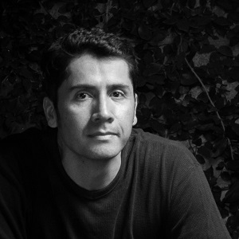
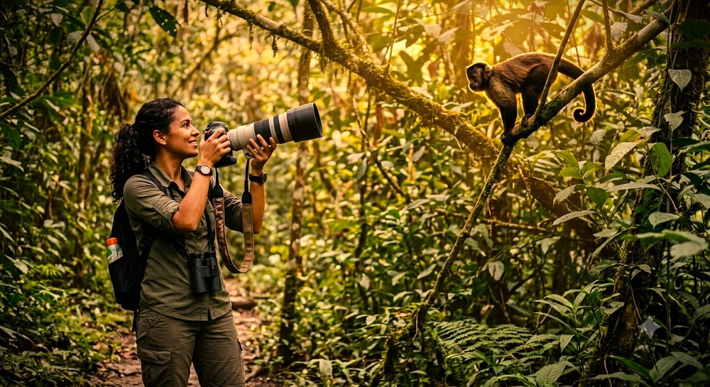

```{=html}
<section class="noticia-container">

<div class="detalle-breadcrumb">
<a href="../../index.html">⌂</a>
<span class="separator">›</span>
<a href="../../noticias.html">Noticias</a>
<span class="separator">›</span>
<span class="current">Concurso de Fotografía</span>
</div>

<article class="noticia-card">

<div class="noticia-header">
<div class="noticia-header-content">
<h1 class="noticia-titulo">Concurso de Fotografía</h1>
<div class="noticia-meta">
<span>15 Julio 2026</span>
<span>5:00 p.m</span>
</div>
</div>
</div>

<div class="noticia-body">

<a class="autor-destacado" href="../../comites.html">
<div class="autor-avatar">

</div>
<div class="autor-info">
<h3>Diego J. Lizcano</h3>
<p>Autor de la noticia</p>
<small>Haz clic para ver el comité</small>
</div>
</a>
<h2 class="apertura">Concurso de Fotografía: Historias de mamíferos colombianos</h2>
<p>Con tus fotografías, puedes contribuir a que se conozca mejor y a conservar nuestra fauna.</p>

<p>Tus fotos pueden mostrar a todo el mundo lo sorprendente y la gran belleza de los mamíferos, el valor de los mismos y su resiliencia. Comparte tus fotos para que sean evaluadas por un panel de expertos y gana fantásticos premios. Envía tus fotos a nuestro concurso hasta el 20 de octubre del 2026.</p>

<div class="modalidad-card">

</div>

<h2>¿Cómo enviar una foto?</h2>

<p>Envíala en el siguiente <a class="enlace-destacado" href="https://forms.gle/J9fSTTFb9nmtCCcM7" target="_blank">formulario de envío </a> con tus datos personales</p>

<p>En caso de que una fotografía sea seleccionada para el otorgamiento de un premio o una mención honorífica, se solicitarán por email los archivos originales en alta resolución.</p>

<p>Las imágenes deben contener los metadatos originales como tipo de cámara, lente, velocidad ISO y apertura, y puede contener información adicional como el nombre del fotógrafo/a. Se podrá solicitar a los concursantes que complementen el material presentado con una explicación más amplia concerniente a la foto, como donde se tomó y en qué contexto. Se podrá solicitar una versión de las fotos de más alta resolución en cualquier momento durante el período del concurso.</p>

<p>Puede concursar con un mínimo de una fotografía hasta un máximo de 10 fotografías por participante. </p>

<p>La participación es gratuita. </p>

<h2>Aspectos a tener en cuenta</h2>

<h3>Concepto Narrativo</h3>

<p>Título: Evita títulos genéricos (como: El Jaguar). Usa metáforas: "Guardián del Umbral" o "Silencio antes del Amanecer".  
Descripción técnica: Menciona el equipo, configuración (ISO, apertura, velocidad), hora y condiciones de luz.  
Historia: ¿Qué hacía el animal? ¿Cuánto tiempo esperaste? ¿Qué sentiste?
</p>

<h3>Aspectos Técnicos (verifica estos puntos antes de enviar):</h3>


<p>Tamaño: menor a 6 MB.  
Dimensiones: entre 1000 x 1000  y  5000 x 5000 pixeles.  
Formato: JPG (más ligero) o PNG si necesitas transparencia o TIF para alta calidad.  
Sin ninguna marca de agua.  
Sin elementos de Inteligencia Artificial (Nano-banana, DALL-E, Midjourney, etc.)
</p>


<h2>Premios a las mejores fotografías en las categorías:</h2>

<p>Mejor fotografía de un mamífero de Colombia. COP$ 1.000.000</p>
<p>Mejor fotografía selección del público. COP$ 500.000</p>
<p>Mejor fotografía de una especie de mamífero amenazado. COP$ 500.000</p>


<h2>FECHAS CLAVE</h2>

<p>Apertura del concurso: 1 de agosto de 2026.</p>
<p>Fecha límite para envío de fotografías: 20 de octubre 2026.</p>
<p>Periodo de evaluación de fotografías por jurado: 21 al 31 de octubre de 2026.</p>
<p>Periodo de evaluación de fotografías por el público: 21 de octubre al 05 de noviembre de 2026.</p>
<p>Publicación de ganadores: 06 de noviembre de 2026.</p>
<p>Envío de premios: 09 de noviembre a 20 de diciembre 2026.</p>


<h2>Criterios de selección</h2>

<p>Se valorará muy positivamente la originalidad de la fotografía, la excelencia o nivel técnico, la composición, el impacto y el mérito artístico.

La Sociedad Colombiana de Mastozoología-SCMas se reserva el derecho de rechazar cualquier imagen adicional que no cumpla las bases del concurso. Al participar, usted reconoce y acepta incondicionalmente las normas de este concurso y las decisiones de la Sociedad Colombiana de Mastozoología-SCMas, que son definitivas y vinculantes. Usted no podrá ganar un premio a menos que cumpla todos los requisitos acá presentados.</p>


<h2>Jurado</h2>

<p>El jurado estará compuesto por dos miembros de la SCMas y <a href="https://www.instagram.com/elnarradordefotos" target="_blank">Mauricio Ballesteros</a> como jurado externo invitado.

<p>Ellos juzgarán a todas las categorías, menos el premio del público.  En este último será el público quién votará a los ganadores en el periodo del 20 octubre al 05 de noviembre del 2026.</p>


<div class="botones-container">


<a href="https://forms.gle/J9fSTTFb9nmtCCcM7" target="_blank" rel="noopener noreferrer" class="btn-animado btn-enviar">
<span>📨</span>
<span>Envía tu Fotografía</span>
</a>

<a href="noticias/2026-07-17_Concurso_Fotografia/files/ConcursoFotografia.pdf" target="_blank" rel="noopener noreferrer" class="btn-animado btn-descargar">
<span>📄</span>
<span>Descarga los Detalles y el Reglamento</span>
</a>
</div>

<div class="detalle-nav">

<a href="../../noticias.html">
<div class="label">Anterior</div>
<div class="title">Noticias</div>
</a>

<a href="../2026-07-14_tercera_circular/tercera_circular.html" class="next">
<div class="label">Siguiente</div>
<div class="title">Tercera Circular</div>
</a>

</div>

</div>
</article>
</section>
```
<script src="concurso_fotografia.js"></script>