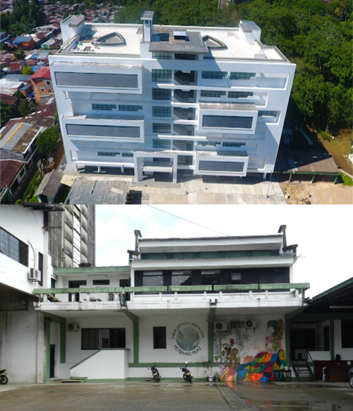

<section class="breadcrumb-container">

<a href="index.html">⌂</a>
›
Sede

</section>

<section class="sede-hero">

<h1>Sede del Congreso</h1>

Información sobre la ciudad anfitriona y la Universidad de la Amazonia

</section>

<section class="seccion-sede">

<button class="carrusel-btn carrusel-prev" id="prevFlorencia" type="button">❮</button>
<button class="carrusel-btn carrusel-next" id="nextFlorencia" type="button">❯</button>

<h2>Florencia, Caquetá</h2>

La ciudad ofrece una amplia variedad de restaurantes y sitios de esparcimiento nocturno, la mayoría de ellos ubicados en la zona rosa de la ciudad, cerca del parque longitudinal Paseo de los Fundadores. Destacan de igual forma sus parques, iglesias, edificios históricos y construcciones modernas. En Florencia existen múltiples monumentos públicos que rinden homenaje a los personajes y hechos históricos de la región, siendo los más conocidos el Monumento a los Colonos, a la Diosa del Chairá y a la Ciencia, Hombre y Manigua. Adicionalmente existen varios museos en Florencia, siendo el Museo Etnográfico y Centro Indigenista del Caquetá uno de los más visitados, pues en sus instalaciones se encuentra una detallada colección de más de diez mil piezas precolombinas pertenecientes a los pobladores originarios de la región.

<button class="carrusel-btn carrusel-prev" id="prevUni" type="button">❮</button>
<button class="carrusel-btn carrusel-next" id="nextUni" type="button">❯</button>

<h2>¿Cómo llegar?</h2>

<iframe src="https://www.google.com/maps/embed?pb=!1m18!1m12!1m3!1d4730.82210175032!2d-75.60683052432172!3d1.62013236064601!2m3!1f0!2f0!3f0!3m2!1i1024!2i768!4f13.1!3m3!1m2!1s0x8e244e2307a3b2af%3A0x2eb9e14897cad6c7!2sUniversidad%20de%20la%20Amazonia%20sede%20principal!5e1!3m2!1ses!2sco!4v1775502218616!5m2!1ses!2sco" width="100%" height="450" style="border:0;" allowfullscreen="" loading="lazy" referrerpolicy="no-referrer-when-downgrade"></iframe>

<h3>🏛 Universidad de la Amazonia</h3>

Comprometida con la excelencia académica, la investigación científica y la conservación de la biodiversidad, la Universidad de la Amazonia es el alma mater del VI Congreso Colombiano de Mastozoología. Ubicada en el corazón de la región amazónica, esta institución pionera en estudios ambientales y biológicos ofrece un escenario incomparable para el intercambio de saberes. Sus modernas instalaciones, laboratorios equipados y su estrecho vínculo con las comunidades locales y los ecosistemas tropicales la convierten en el lugar ideal para tejer redes de colaboración y avanzar en el conocimiento de los mamíferos. ¡Te esperamos en la puerta de entrada a la Amazonía colombiana para vivir una experiencia única de ciencia, cultura y naturaleza!

</section>

&times;

