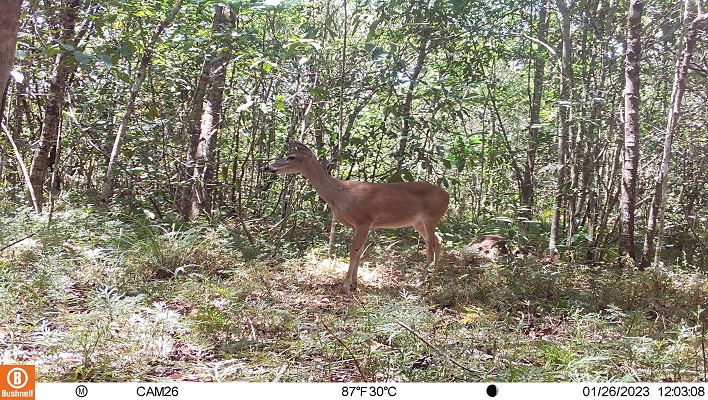

<section class="simposios-hero">

<h1>Simposios del Congreso</h1>

Conoce los simposios temáticos, organizadores y detalles de cada actividad académica del VICCM 2026

</section>

<section class="simposios-page">

<button class="filtro-btn active" data-categoria="todos" type="button">Todos</button>
<button class="filtro-btn" data-categoria="fototrampeo" type="button">Fototrampeo</button>
<button class="filtro-btn" data-categoria="conservacion" type="button">Conservación</button>
<button class="filtro-btn" data-categoria="ecologia" type="button">Ecología</button>
<button class="filtro-btn" data-categoria="primates" type="button">Primates</button>
<button class="filtro-btn" data-categoria="genetica" type="button">Genética</button>

🔎
<input type="text" class="busqueda-input" placeholder="Buscar simposios..." id="busquedaInput">

Organizan

Angelica Díaz Pulido
Diego Lizcano

<h3 class="simposio-titulo">Fototrampeo: Avances y Aplicaciones en Mastozoología</h3>

Este simposio aborda los últimos avances en técnicas de fototrampeo, análisis de datos con inteligencia artificial, y aplicaciones para el monitoreo de mamíferos en ecosistemas tropicales.

Ecología
Conservación
Método

<a href="simposios/fototrampeo/fototrampeo.html" class="simposio-btn">
Ver Simposio Completo →
</a>

➕

<h3>Próximamente</h3>

Espacio disponible

➕

<h3>Próximamente</h3>

Espacio disponible

➕

<h3>Próximamente</h3>

Espacio disponible

➕

<h3>Próximamente</h3>

Espacio disponible

➕

<h3>Próximamente</h3>

Espacio disponible

➕

<h3>Próximamente</h3>

Espacio disponible

➕

<h3>Próximamente</h3>

Espacio disponible

<ul>
<li><a href="#" class="page-item active">1</a></li>
<li><a href="#" class="page-item">2</a></li>
<li><a href="#" class="page-item">→</a></li>
</u>

</section>

<section class="newsletter-section">

<h2>📬 Recibe nuestras noticias</h2>

Suscríbete para recibir las últimas actualizaciones del congreso directamente en tu correo

<input type="email" class="newsletter-input" placeholder="Tu correo electrónico">
<button class="newsletter-btn" type="button">Suscribirme</button>

</section>
