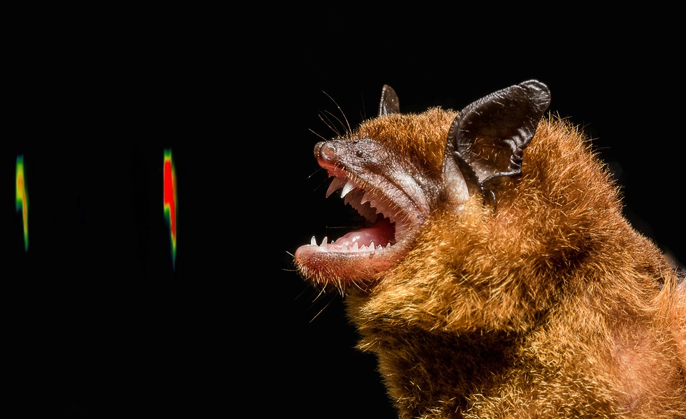

```{=html}
<section class="simposio-detalle-container">

<div class="detalle-breadcrumb">
<a href="../../index.html">⌂</a>
<span class="separator">›</span>
<a href="../../simposios.html">Simposios</a>
<span class="separator">›</span>
<span class="current">Fototrampeo</span>
</div>

<article class="detalle-card">
<div class="detalle-grid">

<div class="col-izquierda">
<div class="imagen-card">

<div class="pie-foto">
📷 Murciélago. 2020. San Martin, Meta, Colombia
</div>
</div>

<div class="organizadores-info">
<h3>Organizan</h3>
<ul class="lista-organizadores">
<li>Daniela Martínez </li>
<li>Franciasco Sánchez</li>
<li>Diego Lizcano</li>
</ul>
<div class="badge-simposio">IV Simposio de Bioacústica · 2026</div>
</div>
</div>

<div class="col-derecha">
<h1>Bioacústica de Mamíferos de Colombia: Desafíos Actuales y Nuevas Rutas de Investigación</h1>
<div class="subtitulo">VI Congreso Colombiano de Mastozoología · Amazonía 2026</div>

<div class="objetivos">
<h2>Objetivos</h2>
<ul class="lista-objetivos">
<li>Visibilizar los avances y desarrollos que se han realizado recientemente frente al uso de Bioacústica como técnica de muestreo de mamíferos y como el uso de los datos obtenidos ha potenciado la generación de nuevo conocimiento.</li>
<li>Mantener la continuidad de un espacio de intercambio de saberes y de fortalecimiento de la red investigadores.</li>
</ul>
</div>

<div class="resumen">
<h2>Resumen</h2>
<p>Revisar el estado actual, los avances y las nuevas contribuciones de la bioacústica al entendimiento de los mamíferos, así como discutir las tendencias emergentes y los retos en los desarrollos metodológicos. Todo ello con el fin de trazar una hoja de ruta que defina las prioridades de investigación y desarrollo tecnológico para la próxima década en el contexto latinoamericano.</p>

<p>Tras el éxito de las versiones anteriores del simposio, donde se ha avanzado en la consolidación de la apropiación de las herramientas acústicas, fortaleciendo el desarrollo de la mastozoología e incentivando el intercambio de experiencias de investigación usando estas herramientas,  se ha generado un incremento exponencial en la generación de datos y el acceso a nuevas tecnologías de monitoreo acústico pasivo (MAP), llevando la bioacústica a un punto de inflexión, exigiendo una transición del inventario hacia el análisis de sistemas complejos y hacia la consolidación del uso de las herramientas para entender más sobre la biología y ecología de los mamíferos colombianos.</p>
</div>

<a href="../../simposios.html" class="btn-volver">← Volver a todos los simposios</a>
</div>

</div>
</article>
</section>
```
<script src="acustica.js"></script>
