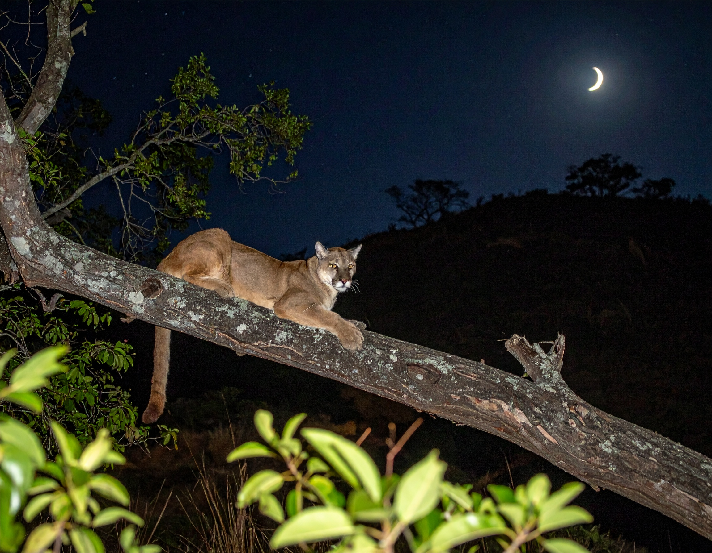

```{=html}
<section class="simposio-detalle-container">

<div class="detalle-breadcrumb">
<a href="../../index.html">⌂</a>
<span class="separator">›</span>
<a href="../../simposios.html">Simposios</a>
<span class="separator">›</span>
<span class="current">Datos atípicos en mamíferos</span>
</div>

<article class="detalle-card">
<div class="detalle-grid">

<div class="col-izquierda">
<div class="imagen-card">

<div class="pie-foto">
📷 Avistamiento sigiloso: datos atípicos que transforman el conocimiento de los mamíferos.
</div>
</div>

<div class="organizadores-info">
<h3>Organizan</h3>
<ul class="lista-organizadores">
<li>Carolina López Castañeda</li>
</ul>
<div class="badge-simposio">Datos atípicos en mamíferos</div>
</div>
</div>

<div class="col-derecha">
<h1>Datos atípicos en mamíferos</h1>
<div class="subtitulo">VI Congreso Colombiano de Mastozoología · Amazonía 2026</div>

<div class="objetivos">
<h2>Objetivo</h2>
<p>En ocasiones los mamíferos resultan ser un grupo difícil de estudiar por sus hábitos nocturnos, bajas densidades poblacionales o simplemente por que evitan estar cerca de los humanos en especial los medianos y grandes. Sin embargo, en ocasiones los investigadores  logran datos interesantes a partir de la observación. Estos datos son vitales para conocer la historia natural de las especies y pueden ser el punto de partida para nuevas indagaciones o contrastar patrones descritos. Por lo tanto, este simposio busca reunir esa información única o anecdótica de mamíferos que no ha sido publicada o divulgada.</p>
</div>

<div class="resumen">
<h2>Resumen</h2>
<p>Muy pronto mas información...</p>

</div>

<a href="../../simposios.html" class="btn-volver">← Volver a todos los simposios</a>
</div>

</div>
</article>
</section>
```
<script src="datos_atipicos.js"></script>
