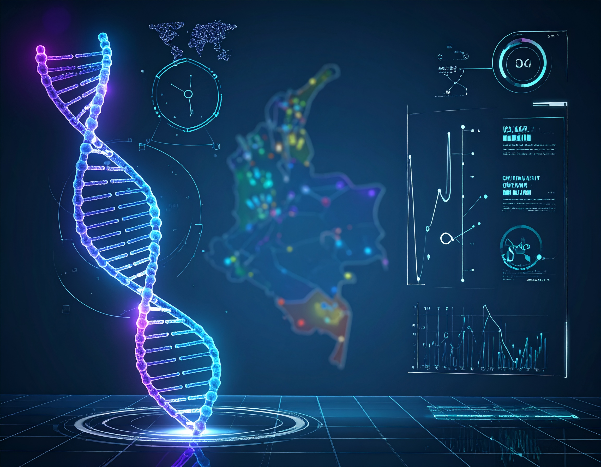

```{=html}
<section class="simposio-detalle-container">

<div class="detalle-breadcrumb">
<a href="../../index.html">⌂</a>
<span class="separator">›</span>
<a href="../../simposios.html">Simposios</a>
<span class="separator">›</span>
<span class="current">Genética y genómica de mamíferos colombianos</span>
</div>

<article class="detalle-card">
<div class="detalle-grid">

<div class="col-izquierda">
<div class="imagen-card">

<div class="pie-foto">
📷 Genómica y conservación: el ADN de los mamíferos colombianos.
</div>
</div>

<div class="organizadores-info">
<h3>Organizan</h3>
<ul class="lista-organizadores">
<li>Alejandra Bonilla-Sánchez</li>
<li>Paola Pulido-Santacruz</li>
<li>Laura M. Aramendiz-Macías</li>
<li>Sergio Penagos</li>
<li>Alejandra Niño-Reyes</li>
<li>Gabriel Pantoja</li>
</ul>
<div class="badge-simposio">II Simposio de Genética y genómica de mamíferos colombianos: diversidad, evolución y conservación</div>
</div>
</div>

<div class="col-derecha">
<h1>II Simposio de Genética y genómica de mamíferos colombianos: diversidad, evolución y conservación</h1>
<div class="subtitulo">VI Congreso Colombiano de Mastozoología · Amazonía 2026</div>

<div class="objetivos">
<h2>Objetivo</h2>
<p>Promover el intercambio de avances científicos, metodológicos y aplicados relacionados con el uso de herramientas genéticas y genómicas en el estudio de la diversidad, evolución, ecología y conservación de mamíferos colombianos. </p>
</div>

<div class="resumen">
<h2>Resumen</h2>
<p>El simposio “Genética y genómica de mamíferos colombianos: diversidad, evolución y conservación 2026” será un espacio de intercambio científico enfocado en los avances recientes de la genética y la genómica aplicadas al estudio de los mamíferos colombianos. A través de presentaciones y discusiones interdisciplinarias, el evento abordará cómo las nuevas tecnologías de secuenciación y las herramientas bioinformáticas han transformado la comprensión de los procesos evolutivos, ecológicos y biogeográficos que estructuran la diversidad de mamíferos en el Neotrópico.</p>
<p>El simposio reunirá investigaciones relacionadas con diversidad genética, historia evolutiva, filogeografía, delimitación de especies, conectividad poblacional, adaptación y conservación, resaltando el papel de la información genética y genómica en la evaluación del estado de conservación y en la generación de estrategias más eficientes para el manejo y protección de las especies. Asimismo, se discutirán los desafíos asociados a la integración de datos, el fortalecimiento de colecciones y bases de datos genéticas, y la necesidad de ampliar redes de colaboración entre investigadores e instituciones en Colombia.</p>
<p>Además de divulgar avances científicos y metodológicos, el evento buscará promover la articulación académica y el intercambio de experiencias entre estudiantes, investigadores y profesionales interesados en el estudio y conservación de los mamíferos colombianos, fortaleciendo el papel de la genética y la genómica como herramientas fundamentales para la investigación y conservación de la biodiversidad del país.</p>

</div>

<a href="../../simposios.html" class="btn-volver">← Volver a todos los simposios</a>
</div>

</div>
</article>
</section>
```
<script src="genetica_genomica.js"></script>
