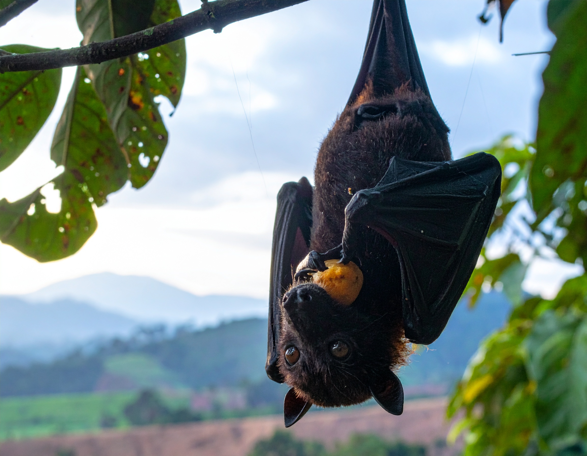

```{=html}
<section class="simposio-detalle-container">

<div class="detalle-breadcrumb">
<a href="../../index.html">⌂</a>
<span class="separator">›</span>
<a href="../../simposios.html">Simposios</a>
<span class="separator">›</span>
<span class="current">VI Simposio Colombiano de Quiropterología</span>
</div>

<article class="detalle-card">
<div class="detalle-grid">

<div class="col-izquierda">
<div class="imagen-card">

<div class="pie-foto">
📷 Murciélagos colombianos: ciencia y conservación desde la diversidad. 
</div>
</div>

<div class="organizadores-info">
<h3>Organizan</h3>
<ul class="lista-organizadores">
<li>Sebastián Montoya-Bustamante</li>
<li>Natalya Zapata-Mesa</li>
<li>María A. Hurtado-Materón</li>
</ul>
<div class="badge-simposio">VI Simposio Colombiano de Quiropterología</div>
</div>
</div>

<div class="col-derecha">
<h1>VI Simposio Colombiano de Quiropterología</h1>
<div class="subtitulo">VI Congreso Colombiano de Mastozoología · Amazonía 2026</div>

<div class="objetivos">
<h2>Objetivo</h2>
<p>El VI Simposio tiene como objetivo central reunir a investigadores, estudiantes, organizaciones no gubernamentales y entidades gubernamentales en torno a una visión integrada de la quiropterología nacional. En particular, se busca articular avances recientes en sistemática, ecología y fisiología, disciplinas cuya integración resulta fundamental para el diseño de estrategias efectivas de conservación. Asimismo, se propone consolidar redes de colaboración entre actores del sector académico, ambiental y de política pública, fortaleciendo así la capacidad colectiva de respuesta ante las amenazas que enfrentan estas especies.De este modo, el simposio se proyecta como un espacio de síntesis, diálogo y proyección científica, orientado no solo a compartir hallazgos recientes, sino a construir una agenda común que impulse la investigación y la conservación de los murciélagos en Colombia durante los próximos años.</p>
</div>

<div class="resumen">
<h2>Resumen</h2>
<p>Los murciélagos constituyen uno de los grupos de mamíferos más diversos y ecológicamente relevantes del planeta, y Colombia, con su excepcional biodiversidad, alberga una de las quiropterofaunas más ricas del mundo. Sin embargo, estos animales continúan enfrentando amenazas crecientes derivadas de la pérdida y transformación de hábitat, el cambio climático y la persistente desinformación sobre su papel en los ecosistemas. Este escenario hace necesario generar un nuevo espacio de encuentro académico que permita evaluar el estado actual del conocimiento sobre los murciélagos colombianos, identificar vacíos de información y trazar rutas de investigación para los próximos años.</p>

</div>

<a href="../../simposios.html" class="btn-volver">← Volver a todos los simposios</a>
</div>

</div>
</article>
</section>
```
<script src="quiropterologia.js"></script>
