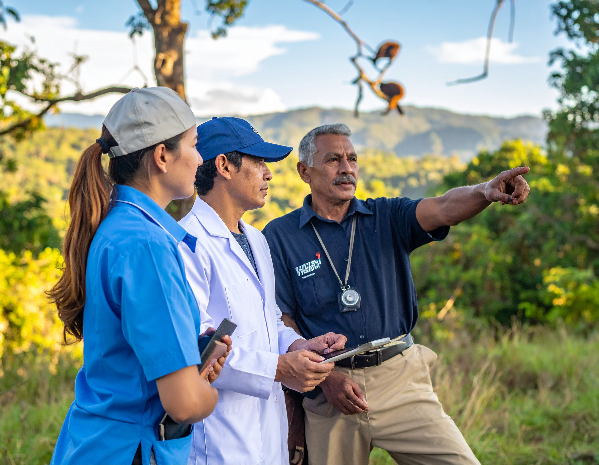
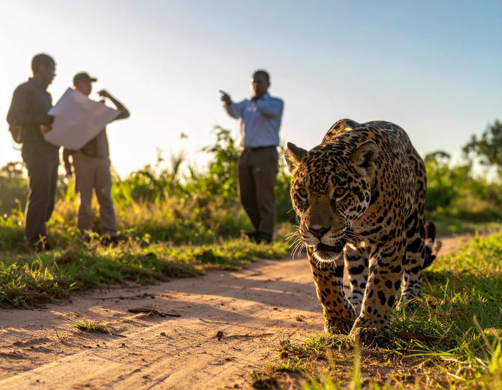

<section class="simposios-hero">

<h1>Simposios del Congreso</h1>

Conoce los simposios temáticos, organizadores y detalles de cada actividad académica del VICCM 2026

</section>

<section class="simposios-page">

<button class="filtro-btn active" data-categoria="todos" type="button">Todos</button>
<button class="filtro-btn" data-categoria="gobernanza" type="button">Gobernanza</button>
<button class="filtro-btn" data-categoria="conservacion" type="button">Conservación</button>
<button class="filtro-btn" data-categoria="fototrampeo" type="button">Fototrampeo</button>
<button class="filtro-btn" data-categoria="ecologia" type="button">Ecología</button>
<button class="filtro-btn" data-categoria="primates" type="button">Primates</button>
<button class="filtro-btn" data-categoria="genetica" type="button">Genética</button>
<button class="filtro-btn" data-categoria="quirópteros" type="button">Quirópteros</button>
<button class="filtro-btn" data-categoria="estrategias" type="button">Estrategias</button>
<button class="filtro-btn" data-categoria="xenartros" type="button">Xenartros</button>
<button class="filtro-btn" data-categoria="mamiferos" type="button">Mamiferos</button>

🔎
<input type="text" class="busqueda-input" placeholder="Buscar simposios..." id="busquedaInput">

Organizan

Freddy Gamboa Avellaneda
Natalia Rodríguez Santa

<h3 class="simposio-titulo">Mamíferos en paisajes productivos de Colombia: enfoques, experiencias y retos</h3>

Este simposio reúne experiencias, investigaciones y enfoques interdisciplinarios sobre mamíferos en paisajes productivos de Colombia, así como el potencial de territorios emergentes para la investigación.

Ecología
Mamiferos
Método

<a href="simposios/mamiferos_paisajes/mamiferos_paisajes.html" class="simposio-btn">
Ver Simposio Completo →
</a>

Organizan

Hugo Mantilla-Meluk
Nicolás Rafael Reyes-Amaya

<h3 class="simposio-titulo">La mastozoología en la era One health</h3>

En consonancia con el Marco Global de Biodiversidad de Kunming-Montreal, que promueve la implementación del esquema de Una Salud.

Ecología
Conservación
Gobernanza

<a href="simposios/mastozoologia_onehealth/mastozoologia_onehealth.html" class="simposio-btn">
Ver Simposio Completo →
</a>

Organizan

Ángela P. Hurtado-Moreno
Diego A. Zárrate Charry
José F. González-Maya
Leonardo Lemus-Mejia
Carlos Eduardo Ortiz Yusty
María Gabriela Aduén Espinosa
Camilo Andrés Correa Ayram
Elkin Noguera
Maria Camila Machado-Aguilera

<h3 class="simposio-titulo">V Simposio de conectividad ecológica y V Simposio de distribución de especies</h3>

 Las aproximaciones de investigación direccionadas a entender cómo se distribuye una especie en el espacio y cómo se mueve a través de un paisaje permiten tener un marco conceptual y metodológico robusto para orientar la toma de decisiones en el ordenamiento territorial.

Ecología
Conservación
Gobernanza

<a href="simposios/conectividad_ecologica/conectividad_ecologica.html" class="simposio-btn">
Ver Simposio Completo →
</a>

Organizan

José F. González Maya
Leonardo Lemus-Mejía
Mauricio Vela Vargas
Angela P. Hurtado-Moreno
Camilo A. Paredes-Casas
Heliot Zarza
Cuauhtémoc Chávez
Andrés Arias-Alzate
Diego A. Zárrate-Charry

<h3 class="simposio-titulo">VI Simposio de pequeños carnívoros en Colombia & II Simposio Nuevas aproximaciones a la conservación de carnívoros de Colombia</h3>

 La conservación de los carnívoros en Colombia es una prioridad debido a su rol crucial en la regulación de poblaciones de presas, el equilibrio trófico y el mantenimiento de la biodiversidad.

Ecología
Conservación
Gobernanza

<a href="simposios/pequenos_carnivoros/pequenos_carnivoros.html" class="simposio-btn">
Ver Simposio Completo →
</a>

Organizan

Mauricio Vela Vargas
Camilo A. Paredes-Casas
Juan Camilo Rubiano
Laura X. Mendoza
Angela P. Hurtado-Moreno
Diego A. Zárrate-Charry
José F. González Maya

<h3 class="simposio-titulo">II Simposio conflicto y coexistencia entre humanos y vida silvestre en Colombia</h3>

 A través de la socialización de experiencias exitosas, se pretende fomentar un cambio de narrativa donde la fauna silvestre sea vista como un componente integral del desarrollo territorial.

Ecología
Conservación
Gobernanza

<a href="simposios/conflicto_coexistencia/conflicto_coexistencia.html" class="simposio-btn">
Ver Simposio Completo →
</a>

Organizan

Angélica Diaz-Pulido
Diego J. Lizcano
Lain Pardo
Leonor Valenzuela

<h3 class="simposio-titulo">VI Simposio de Fototrampeo en Colombia</h3>

Ecología
Conservación
Fototrampeo

<a href="simposios/fototrampeo_colombia/fototrampeo_colombia.html" class="simposio-btn">
Ver Simposio Completo →
</a>

Organizan

Heliot Zarza
Andrés Arias-Alzate
Laura X. Mendoza
Cuauhtémoc Chávez
Karla Pelz
Rurik List
José F. González Maya

<h3 class="simposio-titulo">Fronteras en movimiento: ciencia de vanguardia e impacto real en la conservación de mamíferos</h3>

Este simposio surge de la necesidad crítica de transformar la ciencia de frontera en herramientas operativas que generen cambios tangibles en la conservación de los mamíferos y sus ecosistemas.

Naturaleza
Conservación
Gobernanza
Mamiferos

<a href="simposios/fronteras_movimiento/fronteras_movimiento.html" class="simposio-btn">
Ver Simposio Completo →
</a>

Organizan

Daniela Martínez-Medina
Francisco Sánchez
Diego Lizcano
Víctor Martínez-Arias
Jefferson Sánchez
Andrea Martínez-Bulla
Miguel E. Rodríguez-Posada

<h3 class="simposio-titulo">IV Simposio de Bioacústica de Mamíferos de Colombia: Desafíos Actuales y Nuevas Rutas de Investigación</h3>

Tras el éxito de las versiones anteriores del simposio, donde se ha avanzado en la consolidación de la apropiación de las herramientas acústicas, fortaleciendo el desarrollo de la mastozoología...

Ecología
Conservación
Mamiferos

<a href="simposios/bioacustica_mamiferos/bioacustica_mamiferos.html" class="simposio-btn">
Ver Simposio Completo →
</a>

Organizan

Carolina López Castañeda

<h3 class="simposio-titulo">Datos atípicos en mamíferos</h3>

En ocasiones los mamíferos resultan ser un grupo difícil de estudiar por sus hábitos nocturnos, bajas densidades poblacionales o simplemente por que evitan estar cerca de los humanos...

Ecología
Conservación
Mamiferos

<a href="simposios/datos_atipicos/datos_atipicos.html" class="simposio-btn">
Ver Simposio Completo →
</a>

  <ul>
    <li><a href="simposios.html" class="page-item">1</a></li>
    <li><a href="simposios_2.html" class="page-item2 active">2</a></li>
    <li><a href="simposios_3.html" class="page-item3">3</a></li>
    <li><a href="simposios_3.html" class="page-item4">→</a></li>
  </ul>

</section>

<section class="newsletter-section">

<h2>📬 Recibe nuestras noticias</h2>

Suscríbete para recibir las últimas actualizaciones del congreso directamente en tu correo

<input type="email" class="newsletter-input" placeholder="Tu correo electrónico">
<button class="newsletter-btn" type="button">Suscribirme</button>

</section>
