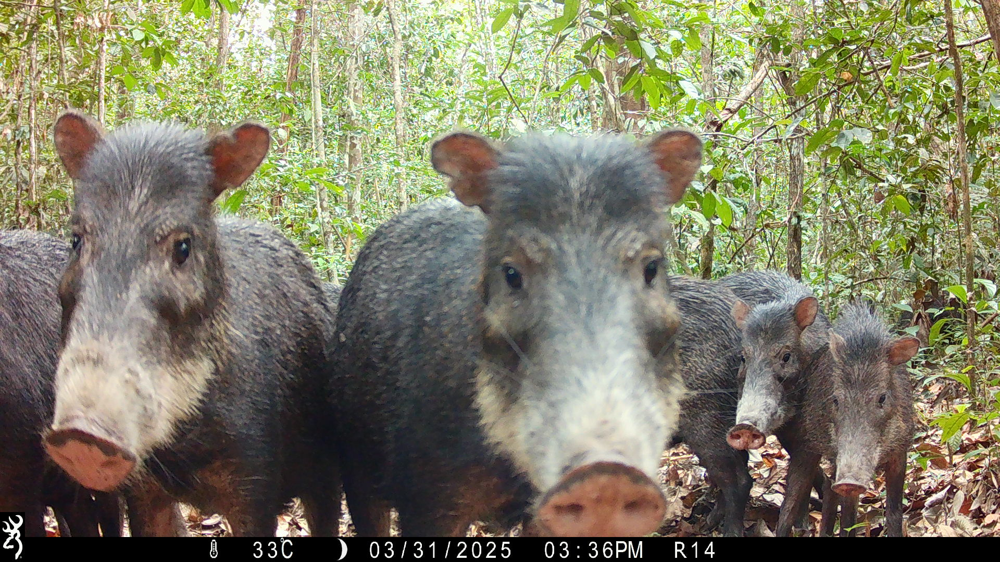
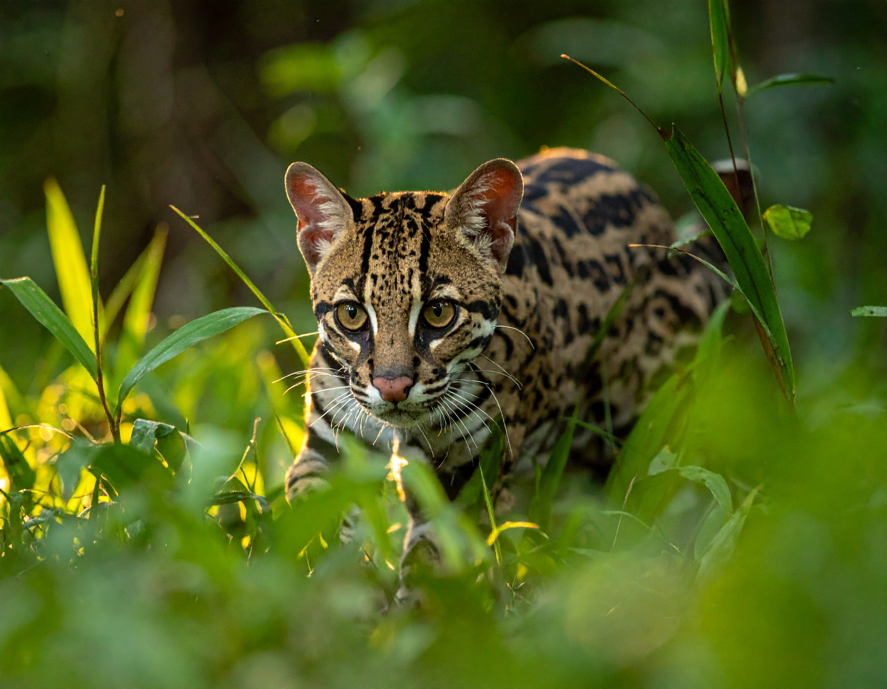
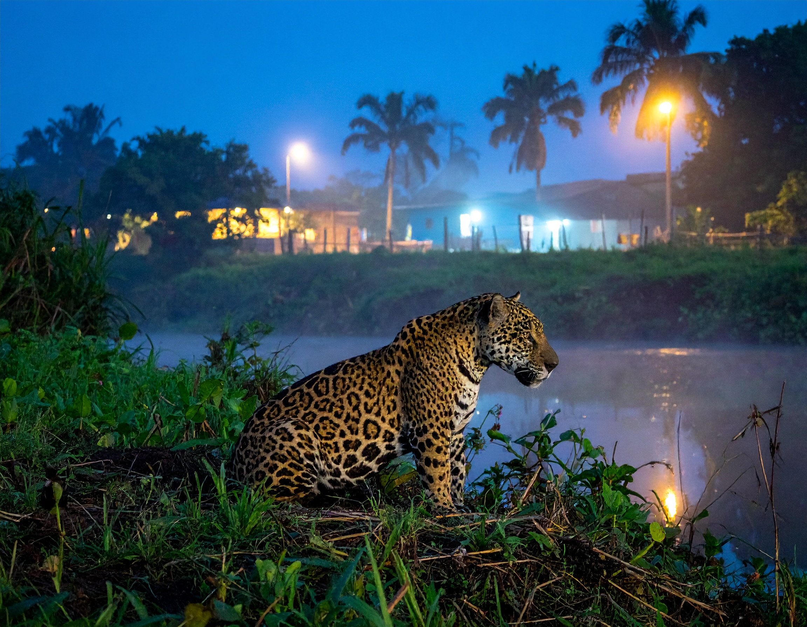
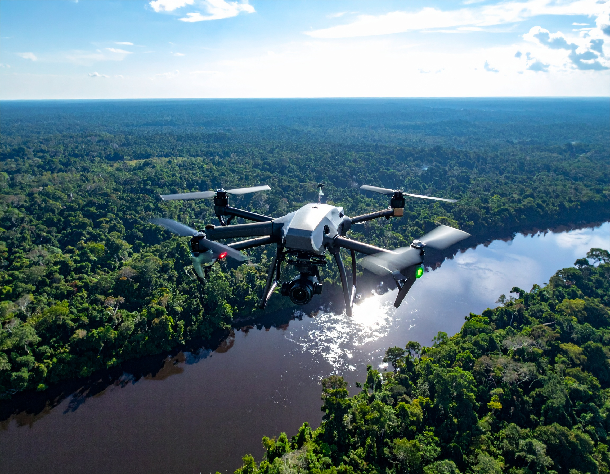
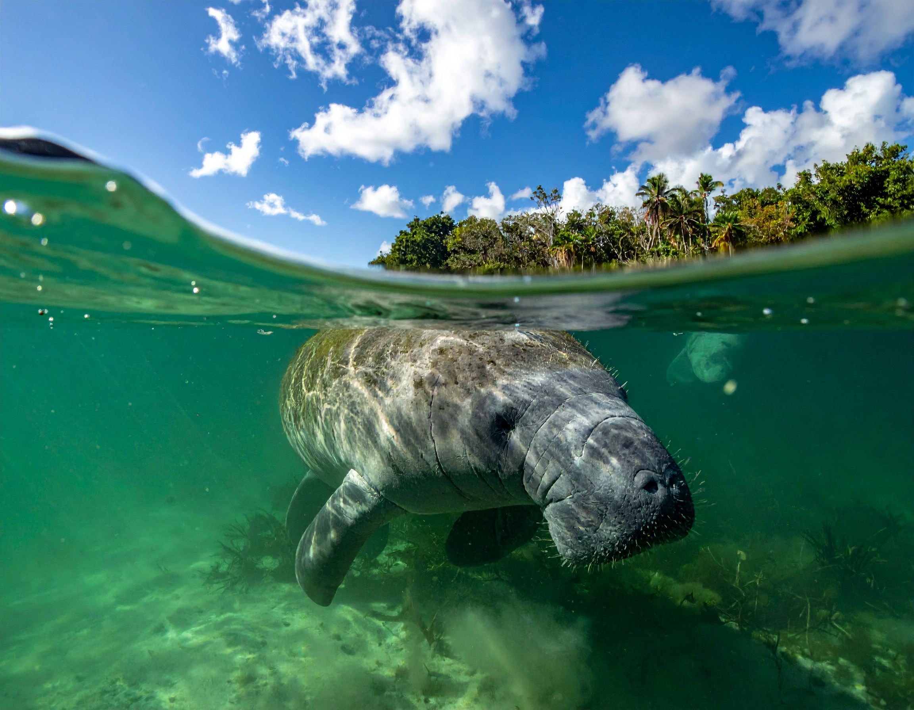
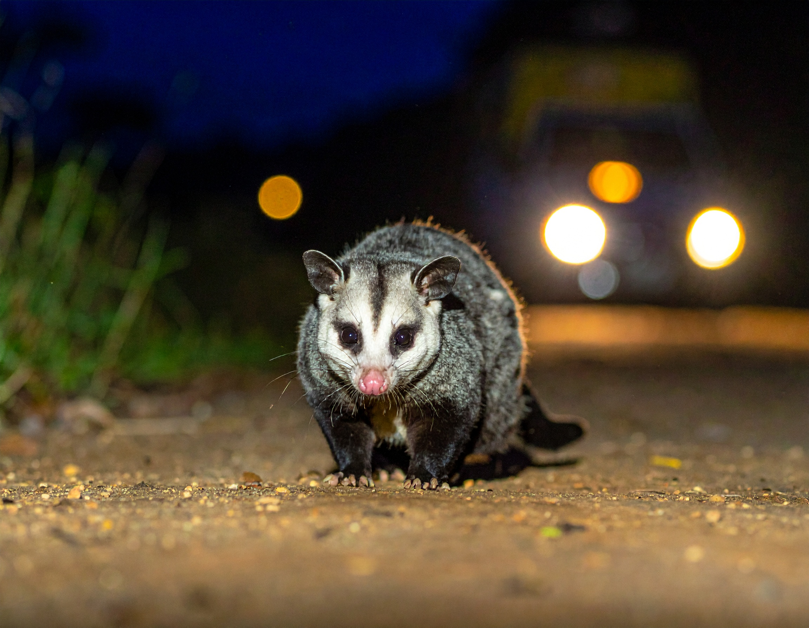
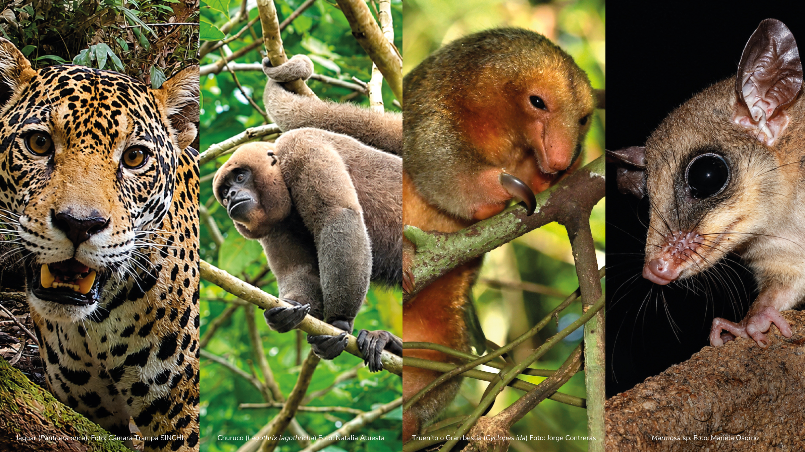
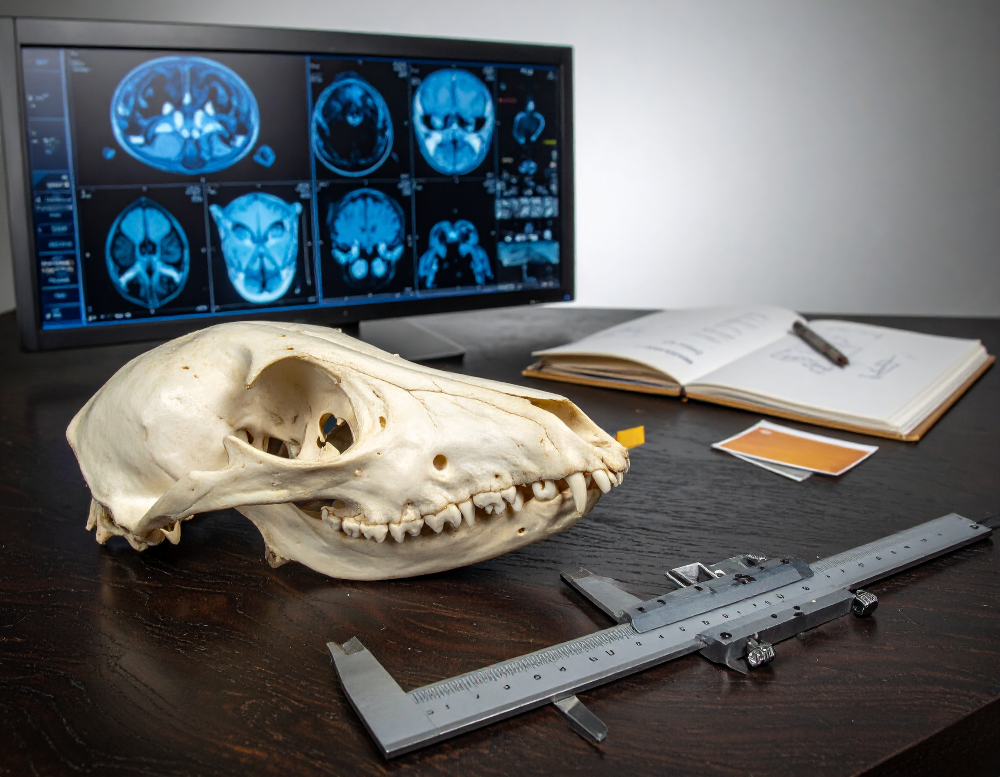
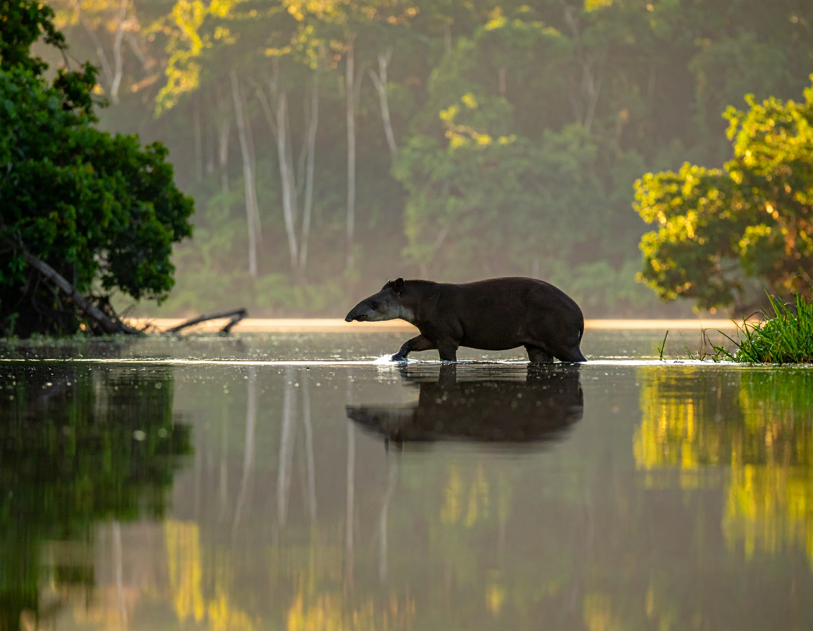

<section class="simposios-hero">

<h1>Simposios del Congreso</h1>

Conoce los simposios temáticos, organizadores y detalles de cada actividad académica del VICCM 2026

</section>

<section class="simposios-page">

<button class="filtro-btn active" data-categoria="todos" type="button">Todos</button>
<button class="filtro-btn" data-categoria="gobernanza" type="button">Gobernanza</button>
<button class="filtro-btn" data-categoria="conservacion" type="button">Conservación</button>
<button class="filtro-btn" data-categoria="fototrampeo" type="button">Fototrampeo</button>
<button class="filtro-btn" data-categoria="ecologia" type="button">Ecología</button>
<button class="filtro-btn" data-categoria="genetica" type="button">Genética</button>
<button class="filtro-btn" data-categoria="estrategias" type="button">Estrategias</button>
<button class="filtro-btn" data-categoria="metodo" type="button">Método</button>
<button class="filtro-btn" data-categoria="acustica" type="button">Acústica</button>
<button class="filtro-btn" data-categoria="anatomia" type="button">Anatomía</button>

🔎
<input type="text" class="busqueda-input" placeholder="Buscar simposios..." id="busquedaInput">

Organizan

Angélica Diaz-Pulido
Diego J. Lizcano
Lain Pardo
Leonor Valenzuela

<h3 class="simposio-titulo">VI Simposio de Fototrampeo en Colombia</h3>

"El fototrampeo se ha convertido en una herramienta y un metodo fundamental para el estudio y monitoreo de los mamíferos en Colombia, permitiendo evaluar patrones de ocupación, abundancia relativa, comportamiento, interacciones ecológicas y respuestas a la transformación del paisaje.

Ecología
Conservación
Fototrampeo

<a href="simposios/fototrampeo_colombia/fototrampeo_colombia.html" class="simposio-btn">
Ver Simposio Completo →
</a>

Organizan

José F. González Maya
Leonardo Lemus-Mejía
Mauricio Vela Vargas
Angela P. Hurtado-Moreno
Camilo A. Paredes-Casas
Heliot Zarza
Cuauhtémoc Chávez
Andrés Arias-Alzate
Diego A. Zárrate-Charry

<h3 class="simposio-titulo">VI Simposio de pequeños carnívoros en Colombia & II Simposio Nuevas aproximaciones a la conservación de carnívoros de Colombia</h3>

 La conservación de los carnívoros en Colombia es una prioridad debido a su rol crucial en la regulación de poblaciones de presas, el equilibrio trófico y el mantenimiento de la biodiversidad.

Ecología
Conservación

<a href="simposios/pequenos_carnivoros/pequenos_carnivoros.html" class="simposio-btn">
Ver Simposio Completo →
</a>

Organizan

Daniela Martínez-Medina
Francisco Sánchez
Diego Lizcano
Víctor Martínez-Arias
Jefferson Sánchez
Andrea Martínez-Bulla
Miguel E. Rodríguez-Posada

<h3 class="simposio-titulo">IV Simposio de Bioacústica de Mamíferos de Colombia: Desafíos Actuales y Nuevas Rutas de Investigación</h3>

La acústica se ha convertido en un metodo de gran éxito. En las versiones anteriores de este simposio se ha avanzado en la consolidación y la apropiación de las herramientas acústicas, fortaleciendo el desarrollo de la mastozoología.

Ecología
Método
Acústica

<a href="simposios/bioacustica_mamiferos/bioacustica_mamiferos.html" class="simposio-btn">
Ver Simposio Completo →
</a>

Organizan

Mauricio Vela Vargas
Camilo A. Paredes-Casas
Juan Camilo Rubiano
Laura X. Mendoza
Angela P. Hurtado-Moreno
Diego A. Zárrate-Charry
José F. González Maya

<h3 class="simposio-titulo">II Simposio conflicto y coexistencia entre humanos y vida silvestre en Colombia</h3>

 A través de la socialización de experiencias exitosas, se pretende fomentar un cambio de narrativa donde la fauna silvestre sea vista como un componente integral del desarrollo territorial.

Conservación
Gobernanza

<a href="simposios/conflicto_coexistencia/conflicto_coexistencia.html" class="simposio-btn">
Ver Simposio Completo →
</a>

Organizan

Heliot Zarza
Andrés Arias-Alzate
Laura X. Mendoza
Cuauhtémoc Chávez
Karla Pelz
Rurik List
José F. González Maya

<h3 class="simposio-titulo">Fronteras en movimiento: ciencia de vanguardia e impacto real en la conservación de mamíferos</h3>

Este simposio surge de la necesidad crítica de transformar la ciencia de frontera en herramientas operativas que generen cambios tangibles en la conservación de los mamíferos y sus ecosistemas.

Conservación
Mamiferos

<a href="simposios/fronteras_movimiento/fronteras_movimiento.html" class="simposio-btn">
Ver Simposio Completo →
</a>

Organizan

Carolina López Castañeda

<h3 class="simposio-titulo">Datos atípicos en mamíferos</h3>

En ocasiones los mamíferos resultan ser un grupo difícil de estudiar por sus hábitos nocturnos, bajas densidades poblacionales o simplemente por que evitan estar cerca de los humanos...

Ecología
Mamíferos

<a href="simposios/datos_atipicos/datos_atipicos.html" class="simposio-btn">
Ver Simposio Completo →
</a>

Organizan

Julio Javier Chacón Pacheco
Angie Natally Tinoco Sotomayor
Gerson Andrés Salcedo Rivera
María Isabel Maya Aguirre
Julián David Ruiz Gómez

<h3 class="simposio-titulo">Avances en el estudio de la mastofauna del Caribe colombiano</h3>

Este espacio radica en la necesidad de integrar esfuerzos dispersos, fomentar la colaboración científica y generar alianzas estratégicas que impulsen nuevas agendas de investigación...

Ecología
Método

<a href="simposios/mastofauna_caribe/mastofauna_caribe.html" class="simposio-btn">
Ver Simposio Completo →
</a>

Organizan

Juan Camilo Rubiano Pérez
William Bonell
Ivan Mauricio Vela Vargas
Ginna Gómez Junco
Francisco Stiven Gómez Castañeda

<h3 class="simposio-titulo">I Simposio de Biología, Ecología y Conservación de Marsupiales, Roedores y Musarañas</h3>

Actualmente, Colombia cuenta con 41 especies de marsupiales registradas para el territorio, lo que representa aproximadamente el 7,4% de la riqueza de los mamíferos del país.

Ecología
Conservación
Marsupiales

<a href="simposios/biologia_ecologia/biologia_ecologia.html" class="simposio-btn">
Ver Simposio Completo →
</a>

Organizan

Natalia Atuesta-Dimian
Mónica Peñuela
Javier García
Hugo Fernando López-Arévalo
Catalina Cárdenas

<h3 class="simposio-titulo">Investigación mastozoológica en la Amazonía Colombiana: Avances y perspectivas</h3>

La Panamazonia es una de las regiones más ricas en mamíferos del mundo y, a nivel nacional, se estima que la región alberga una alta diversidad de mastofauna, así como algunas de las poblaciones en mejor estado de conservación.

Ecología
Conservación
Mamíferos

<a href="simposios/investigacion_mastozoologica/investigacion_mastozoologica.html" class="simposio-btn">
Ver Simposio Completo →
</a>

Organizan

Nicolas Reyes-Amaya
Alejandra Pardo
Paula Calambas Pizo
Maria Antonia Montilla

<h3 class="simposio-titulo">Simposio Bases Anatómicas de la Biodiversidad en Mamíferos</h3>

 El estudio de la anatomía de los mamíferos vivos ha sido una herramienta fundamental para clasificarlos, comprenderlos y reflexionar sobre su naturaleza y evolución.

Mamíferos
Anatomía

<a href="simposios/bases_anatomicas/bases_anatomicas.html" class="simposio-btn">
Ver Simposio Completo →
</a>

Organizan

Federico Mosquera Guerra
Diego Lizcano
Carlos Saavedra

<h3 class="simposio-titulo">Tapires neotropicales: investigación y desafíos para su conservación</h3>

 Los tapires neotropicales desempeñan un rol fundamental en el funcionamiento de los ecosistemas, al actuar como dispersores de semillas y modeladores de la dinámica de los bosques tropicales.

Ecología
Conservación
Tapires

<a href="simposios/tapires_neotropicales/tapires_neotropicales.html" class="simposio-btn">
Ver Simposio Completo →
</a>

Organizan

Alejandra Bonilla-Sánchez
Paola Pulido-Santacruz
Laura M. Aramendiz-Macías
Sergio Penagos
Alejandra Niño-Reyes
Gabriel Pantoja

<h3 class="simposio-titulo">II Simposio de Genética y genómica de mamíferos colombianos: diversidad, evolución y conservación</h3>

 El simposio “Genética y genómica de mamíferos colombianos: diversidad, evolución y conservación 2026” será un espacio de intercambio científico enfocado en los avances recientes de la genética y la genómica aplicadas al estudio de los mamíferos colombianos.

Ecología
Conservación
Genética

<a href="simposios/genetica_genomica/genetica_genomica.html" class="simposio-btn">
Ver Simposio Completo →
</a>

  <ul>
    <li><a href="simposios.html" class="page-item">1</a></li>
    <li><a href="simposios_2.html" class="page-item2 active">2</a></li>
    <li><a href="simposios_3.html" class="page-item3">3</a></li>
    <li><a href="simposios_3.html" class="page-item4">→</a></li>
  </ul>

</section>

<section class="newsletter-section">

<h2>📬 Recibe nuestras noticias</h2>

Suscríbete para recibir las últimas actualizaciones del congreso directamente en tu correo

<input type="email" class="newsletter-input" placeholder="Tu correo electrónico">
<button class="newsletter-btn" type="button">Suscribirme</button>

</section>
