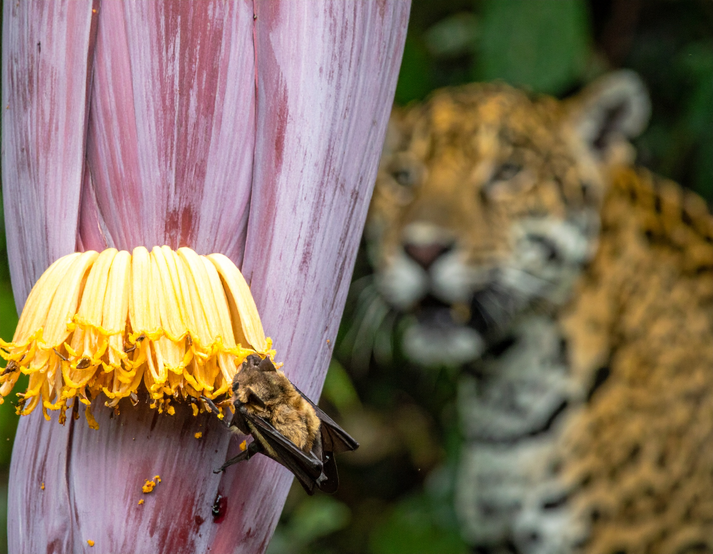
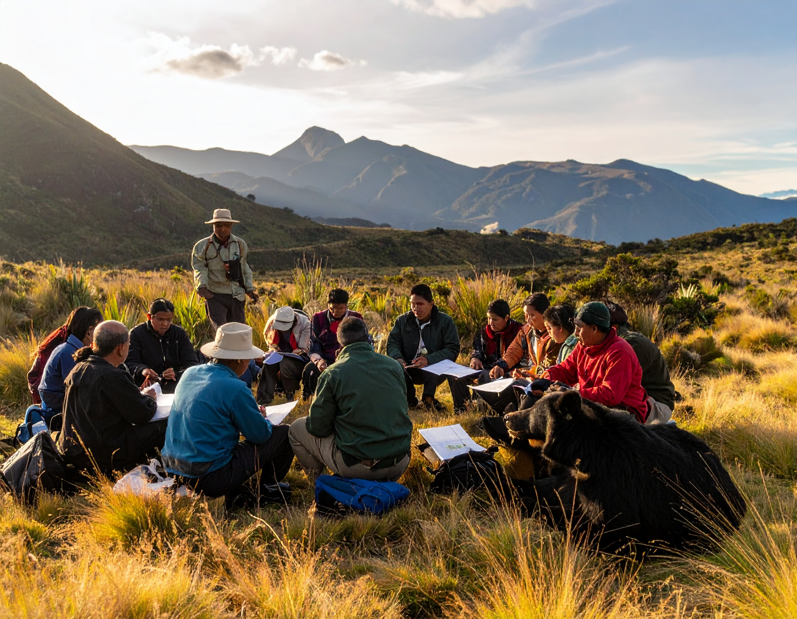
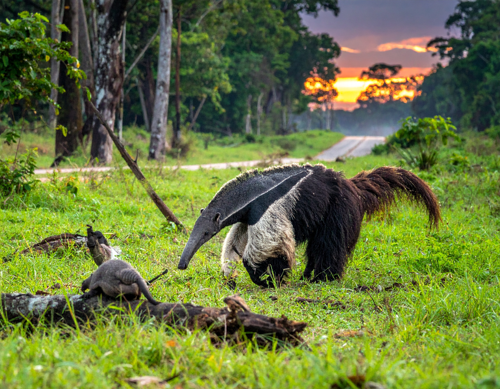
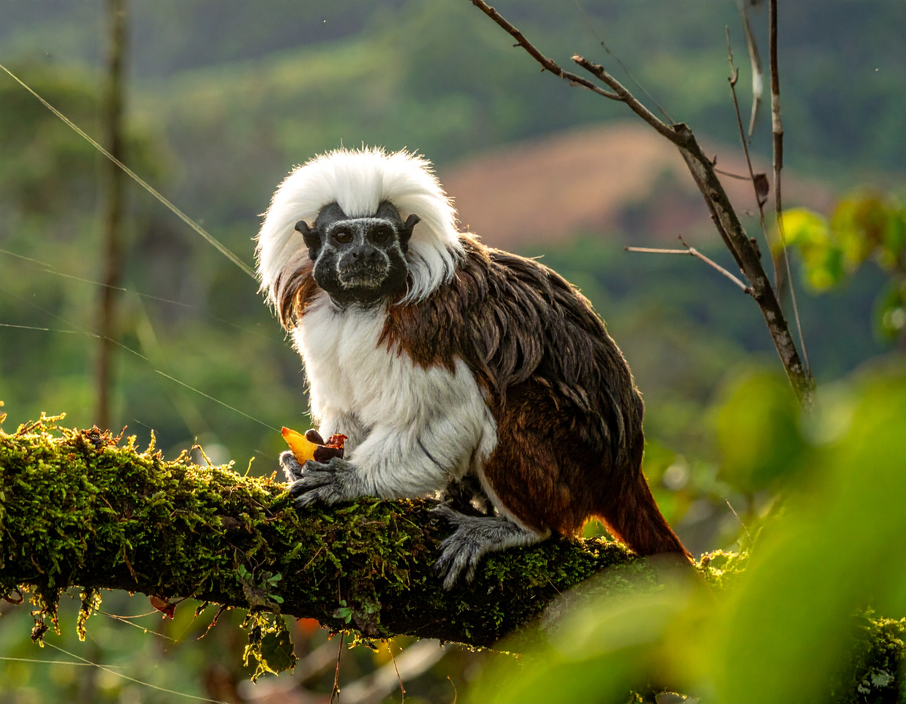
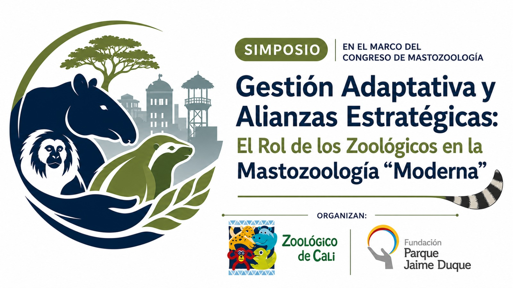
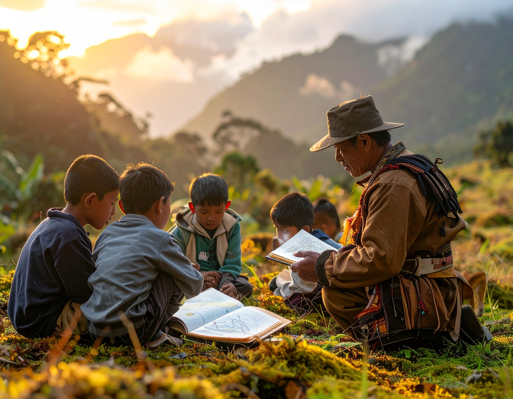

<section class="simposios-hero">

<h1>Simposios del Congreso</h1>

Conoce los simposios temáticos, organizadores y detalles de cada actividad académica del VICCM 2026

</section>

<section class="simposios-page">

<button class="filtro-btn active" data-categoria="todos" type="button">Todos</button>
<button class="filtro-btn" data-categoria="fototrampeo" type="button">Fototrampeo</button>
<button class="filtro-btn" data-categoria="conservacion" type="button">Conservación</button>
<button class="filtro-btn" data-categoria="ecologia" type="button">Ecología</button>
<button class="filtro-btn" data-categoria="primates" type="button">Primates</button>
<button class="filtro-btn" data-categoria="genetica" type="button">Genética</button>
<button class="filtro-btn" data-categoria="quiropteros" type="button">Quirópteros</button>
<button class="filtro-btn" data-categoria="estrategias" type="button">Estrategias</button>
<button class="filtro-btn" data-categoria="xenartros" type="button">Xenartros</button>
<button class="filtro-btn" data-categoria="gestion adaptativa" type="button">Gestión Adaptativa</button>

🔎
<input type="text" class="busqueda-input" placeholder="Buscar simposios..." id="busquedaInput">

Organizan

Kevin González Gutiérrez
John Harold Castaño Salazar

<h3 class="simposio-titulo">Interacciones troficas en mamiferos: de flores a depredadores</h3>

Las interacciones tróficas son fundamentales para comprender procesos ecológicos a nivel de individuo, especie, población y comunidad, ya que permiten analizar aspectos comportamentales, metabólicos, fenológicos, geográficos y dependientes de la escala en la transformación del paisaje.

Ecología
Método

<a href="simposios/interacciones/interacciones.html" class="simposio-btn">
Ver Simposio Completo →
</a>

Organizan

Miguel E. Rodríguez-Posada
Dora Catalina Concha Osbahr
Bibiana Gómez-Valencia
Andrea Natalia Martínez Bulla

<h3 class="simposio-titulo">Estrategias comunitarias en gestión del conocimiento y conservación de mamíferos</h3>

Recientemente se ha incrementado la participación de actores sociales, especialmente las comunidades locales, en las estrategias de gestión y conservación de la biodiversidad en sus territorios para garantizar su efectividad bajo su propia gobernanza.

Conservación
Monitoreo Comunitario
Gobernanza

<a href="simposios/estrategias/estrategias.html" class="simposio-btn">
Ver Simposio Completo →
</a>

Organizan

Liceth Margarita Suárez Payares
Tomás Villada-Cadavid
Melquisedec Gamba-Ríos
Sandra Bernal
Yesyca Andrea López Bolaños
Ana María Ávila García
Diana Carina Vallejo Cardozo

<h3 class="simposio-titulo">I Simposio de Refugios de Murciélagos en Colombia</h3>

 Bastaron dos décadas para percatarnos acerca de lo imperativo de proponer nuevas estrategias para el estudio de los refugios de murciélagos en Colombia.

Ecología
Conservación
Murciélagos

<a href="simposios/refugios/refugios.html" class="simposio-btn">
Ver Simposio Completo →
</a>

Organizan

Carlos Aya Cuero
Maria Jose Andrade
Julio Chacón Pacheco
Catalina Perez
Nathalia Niño
Cesar Rojano

<h3 class="simposio-titulo">VI Simposio Colombiano de Perezosos, Armadillos y Hormigueros</h3>

 El VI Simposio Colombiano de Perezosos, Armadillos y Hormigueros da continuidad a los cinco encuentros previos que han consolidado un espacio técnico y científico dedicado al estudio y conservación de los xenartros en el país.

Ecología
Xenartros
Perezosos

<a href="simposios/perezosos/perezosos.html" class="simposio-btn">
Ver Simposio Completo →
</a>

Organizan

Sebastián García Restrepo
Sebastián O. Montilla
María Gabriela Luna Conde
Rafael Santiago Escucha Ramírez
Efraín Camilo Mora Cruz
Sergio González Linares

<h3 class="simposio-titulo">VII Simposio Colombiano de Primatología</h3>

 Colombia alberga una alta riqueza de especies de primates (alrededor de 38 a 40 especies) y a lo largo de los años se ha posicionado como un referente latinoamericano en cuanto al potencial de investigación y a las capacidades de sus profesionales y grupos de investigación en Primatología.

Ecología
Conservación
Primates

<a href="simposios/primatologia/primatologia.html" class="simposio-btn">
Ver Simposio Completo →
</a>

Organizan

Dave Wehdeking
Catalina Rodríguez Álvarez
Sandra Marcela Gómez
Carlos Andrés Galvis
Leonardo Arias Bernal

<h3 class="simposio-titulo">Gestión Adaptativa y Alianzas Estratégicas: El Rol de los Zoológicos en la Mastozoología Moderna</h3>

 La conservación de los mamíferos enfrenta desafíos cada vez más complejos que requieren enfoques integrados y una colaboración efectiva entre múltiples actores.

Ecología
Conservación
Gestión Adaptativa
Zoológicos

<a href="simposios/gestion_adaptativa/gestion_adaptativa.html" class="simposio-btn">
Ver Simposio Completo →
</a>

Organizan

Catalina Rodriguez
César Rojano
Mónica Peñuela Salgado
Juan Camilo Rubiano Pérez
Mariana Zanotti Tavares de Oliveira
Ginna Gómez Junco
Diana Alejandra Moncada Garzón
Katherine Pérez Gómez
Angie Tinoco Sotomayor
Luisa Fernanda Blanco Uribe
Carlos Ágamez López
Oscar Ducuara
Mariana Vélez Orozco
María Camila Machado Aguilar

<h3 class="simposio-titulo">Comunicación, Sensibilización y Enseñanza para la Conservación de Mamíferos: Experiencias, Estrategias y Retos</h3>

Este simposio busca generar un espacio de encuentro e intercambio entre investigadores, docentes, estudiantes, organizaciones e iniciativas que desarrollan procesos de comunicación, sensibilización y enseñanza relacionados con la conservación de mamíferos.

Conservación
Comunicación
Enseñanza

<a href="simposios/comunicacion_sensibilizacion/comunicacion_sensibilizacion.html" class="simposio-btn">
Ver Simposio Completo →
</a>

➕

<h3>Próximamente</h3>

Espacio disponible

➕

<h3>Próximamente</h3>

Espacio disponible

➕

<h3>Próximamente</h3>

Espacio disponible

➕

<h3>Próximamente</h3>

Espacio disponible

➕

<h3>Próximamente</h3>

Espacio disponible

➕

<h3>Próximamente</h3>

Espacio disponible

➕

<h3>Próximamente</h3>

Espacio disponible

  <ul>
    <li><a href="simposios.html" class="page-item">1</a></li>
    <li><a href="simposios_2.html" class="page-item2">2</a></li>
    <li><a href="simposios_3.html" class="page-item3">3</a></li>
    <li><a href="simposios_4.html" class="page-item4 active">4</a></li>
    <li><a href="simposios_5.html" class="page-item5">5</a></li>
    <li><a href="simposios_5.html" class="page-item6">→</a></li>
  </ul>

</section>

<section class="newsletter-section">

<h2>📬 Recibe nuestras noticias</h2>

Suscríbete para recibir las últimas actualizaciones del congreso directamente en tu correo

<input type="email" class="newsletter-input" placeholder="Tu correo electrónico">
<button class="newsletter-btn" type="button">Suscribirme</button>

</section>
